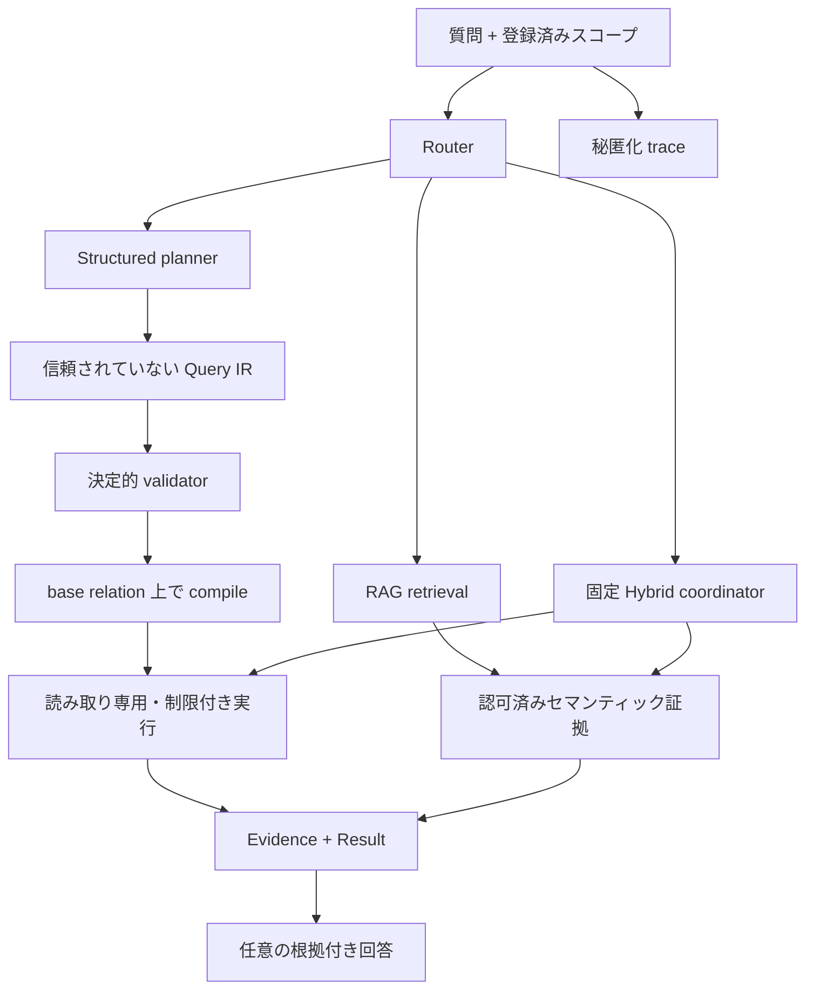

# Maglev

[English](README.md) | [简体中文](README.zh-CN.md) | [日本語](README.ja.md)

> **Technical translation review pending:** この日本語版は v0.2.0 のコードと英語版 README に同期していますが、公開前に日本語ネイティブによる技術レビューが必要です。英語版 [README.md](README.md) が正本です。

[](https://github.com/benjis/maglev/actions/workflows/ci.yml)
[](https://www.ruby-lang.org/)
[](https://rubyonrails.org/)
[](LICENSE.txt)

Maglev 0.2 は ActiveRecord アプリケーション向けの Rails ネイティブな読み取り専用の知識・クエリレイヤーです。自然言語の質問を三つの明示的なルートで処理します。

- **Structured:** 質問 → 検証済み Query IR → 合成可能な
  `ActiveRecord::Relation` または制限付き集約値。
- **RAG:** 質問 → 認可済みセマンティック検索 → 必要に応じて根拠付き回答。
- **Hybrid:** 構造化フィルタと RAG 証拠を組み合わせる二つの固定ワークフロー。

モデルから公開されるのはアプリケーションが明示した allowlist のみです。構造化コンパイルは呼び出し元の base relation から始まり、それを狭めることしかできません。RAG の検索と回答生成は分離されています。

```ruby
resource_authorizer = ->(_entry, user) { user.account_id == current_account.id }
result = current_account.invoices.maglev_request(
  "500ドルを超える未払い請求書",
  mode: :structured,
  planner_adapter: planner,
  authorizer: resource_authorizer,
  user: current_user
)

retrieval = SupportTicket.retrieve("解約手続きで止まった顧客", user: current_user)
answer = SupportTicket.ask("繰り返し発生している解約問題は？", user: current_user)
```

## はじめに：データ経路を選ぶ

Maglev の全アーキテクチャを理解してから使い始める必要はありません。まず、回答に
必要なデータの種類を選びます。

| ユーザーの質問 | 必要なデータ | 宣言 | 呼び出し |
| --- | --- | --- | --- |
| 「期限切れ請求書はいくつ？」 | 正確な column、filter、count | `queryable` | `maglev_request(..., mode: :structured)` |
| 「解約時に顧客が訴える問題は？」 | 本文、comment、attachment | `knowledge` | `retrieve` または `ask` |
| 「二重請求に触れた open ticket は？」 | 正確な status + semantic text | 両方 | `maglev_request(..., mode: :hybrid)` |

基本の mental model は四つです。

1. `maglev_resource :support_tickets` は model に安定した Maglev resource 名を付けます。
2. `queryable` は planner が filter、sort、join、aggregate できる ActiveRecord allowlist です。
3. `knowledge` は semantic evidence として index する内容を選びます。
4. 認可と structured query の base `ActiveRecord::Relation` はアプリケーションが
   提供します。Maglev が権限を広げることはありません。

## Maglev を選ぶ理由

- `Maglev::Railtie` を持つ通常の Ruby gem。Rails Engine や別 API ではありません。
- ActiveRecord-first の構造化クエリ。不制限の SQL/Ruby を生成・実行しません。
- フィールド、関連、scope、集約、知識ソースを明示的に登録します。
- テナント・認可制約はアプリケーション所有の relation が保持します。
- pgvector、正規化スコア、決定的な予算、検査可能な証拠を備えた source-aware RAG。
- 不変の plan/result と既定で秘匿化された trace。
- デフォルトテストは決定的 fake adapter を使い、外部 provider を呼びません。

## アーキテクチャ



Registry は権限境界です。リクエストごとの schema snapshot には認可された登録済みリソースだけが含まれ、レコード値は含まれません。Provider 出力は決定的検証が成功するまで信頼されません。

## インストール

Ruby 3.3+、Rails 7.1 または 8.0、PostgreSQL、pgvector が必要です。

```ruby
# Gemfile
gem "maglev-rb", "~> 0.2.0"
```

```bash
bundle install
bin/rails generate maglev:install --embedding-dimensions=1536
bin/rails db:migrate
```

Generator は initializer、`maglev_chunks`、source/tenant metadata、HNSW cosine index、`maglev_index_states` を作成します。Owner が UUID 主キーを使う場合は生成 migration を調整してください。

## 設定

組み込み embedding、generation、planner クライアントは OpenAI-compatible HTTP API を使います。Embedding と generation は別 provider にできます。

```ruby
Maglev.configure do |config|
  config.embedding_provider do |provider|
    provider.url = ENV.fetch("MAGLEV_EMBEDDING_URL", "https://api.openai.com/v1")
    provider.api_key = ENV["MAGLEV_EMBEDDING_API_KEY"]
    provider.model = "text-embedding-3-small"
    provider.dimensions = 1536
  end

  config.generation_provider do |provider|
    provider.url = ENV.fetch("MAGLEV_GENERATION_URL", "https://api.openai.com/v1")
    provider.api_key = ENV["MAGLEV_GENERATION_API_KEY"]
    provider.model = "gpt-4.1-mini"
  end

  config.planner_adapter = Maglev::Adapters::FaradayPlanner.new
  config.routing_adapter = MyRoutingAdapter.new # mode: :auto の場合のみ必要

  config.chunk_size = 1000
  config.minimum_similarity = nil
  config.retrieval_max_candidates = 1000
  config.context_max_characters = 4000
  config.context_per_owner_characters = 1200

  config.snapshot_attribute_max_characters = 20_000
  config.snapshot_related_record_max_characters = 50_000
  config.snapshot_max_characters = 100_000
  config.snapshot_max_chunks = 100

  config.structured_query_timeout = 5
  config.structured_evidence_max_rows = 100
  config.structured_evidence_max_bytes = 32_768
end
```

必要に応じて独自の `embedding_adapter`、`generation_adapter`、`planner_adapter`、`routing_adapter`、`attachment_extractor`、`authorization_adapter` を注入できます。

## リソースの登録

`maglev_resource` が v0.2 の主要 DSL です。Structured と knowledge の capability は独立しており、片方または両方を宣言できます。

### コメント付き structured resource

```ruby
class Invoice < ApplicationRecord
  # 通常の Rails association/scope が引き続き source of truth です。
  belongs_to :account
  scope :due_before, ->(date) { where(due_on: ..date) }

  # :invoices は Maglev plan/request で使う安定した resource identifier です。
  maglev_resource :invoices do
    # Planner が resource の意味を理解するための説明です。
    description "認可されたアカウントに属する請求書"
    synonyms "bills"

    # この block は structured ActiveRecord query だけを制御します。
    queryable do
      # 実在する database column の正確な filter/sort を許可します。
      # enum は planner が使える status 値も制限します。
      field :status, enum: %w[draft open paid void]
      field :amount, description: "アカウント通貨での請求総額"
      field :due_on, synonyms: ["deadline"]
      field :paid_at

      # Planner が要求しても sensitive column を明示的に拒否します。
      prohibit :number, :internal_note

      # 別途登録された :accounts resource への association を許可します。
      association :account, resource: :accounts

      # 既存 Rails scope と、その typed parameter を許可します。
      scope :due_before,
        parameters: {date: {type: :date, required: true}}

      # 許可する aggregate function/column を限定します。
      aggregates count: true, sum: [:amount], average: [:amount]

      # Global/request limit に加えて resource-level ceiling を設定します。
      limits rows: 50, operations: 8, joins: 1

      # Structured plan ごとに caller の認可を必須にします。
      authorization :required
    end

    # この別 block は semantic indexing と RAG を制御します。
    # 同じ field をここに書いても structured 権限は広がりません。
    knowledge do
      expose :status, :amount, :due_on, :paid_at
    end
  end
end
```

暗黙に公開されるものはありません。`authorization :required` のリソースは呼び出し元が認可しない限り schema snapshot に入りません。`allow_unscoped_model_queries` は明示的 opt-in で、本当に公開されたデータだけに使ってください。

`queryable` は制約された ActiveRecord query contract だけを定義します。
`knowledge` は RAG の indexing/retrieval source だけを定義します。
`maglev_resource` は統一 resource 宣言で、どちらか一方または両方を含められます。
`knowledge` を宣言しない model は `search`、`retrieve`、`ask`、snapshot、
indexing callback を利用できません。

この宣言は schema dump ではなく allowlist です。`field` にない column は Query IR に
入れず、`expose` などの knowledge source にない値は semantic snapshot に入りません。

### 同じ field を両方に宣言する理由

同じ column が異なる役割を持つことがあります。

- `field :status` は `status = "open"` のような正確な条件を許可します。
- `expose :status` は `status: open` を snapshot に書き、検索 evidence の context を保ちます。

片方の宣言からもう片方は推論されません。ID、日付、enum、金額など正確さが重要な値は
`queryable`、本文、説明、comment、resolution、attachment text は `knowledge`、status、
priority、product area のような context field は両方に置くのが一般的です。

### RAG の価値が分かる resource

答えが一つの column ではなく人間の文章に存在するとき、RAG が役立ちます。この例では
structured query が open/high-priority ticket を選び、RAG が ticket 本文、comment、
resolution、添付 log にある「二重請求」のさまざまな表現を理解します。

```ruby
class SupportTicket < ApplicationRecord
  belongs_to :account
  has_many :comments
  has_many_attached :files
  has_rich_text :resolution

  maglev_resource :support_tickets do
    description "顧客サポート request と調査 evidence"

    queryable do
      # 正確で typed な structured filter に適した field。
      field :status, enum: %w[open pending resolved closed]
      field :priority, enum: %w[low normal high urgent]
      field :product_area
      field :created_at
      prohibit :requester_email, :internal_notes
      limits rows: 100, operations: 8, joins: 1
      authorization :required
    end

    knowledge do
      # Exact filter では表せない意味を prose から取得します。
      expose :subject, :body

      # Queryable field と重ねて evidence に business context を残します。
      expose :status, :priority, :product_area

      # Related conversation を bounded/deterministic に追加します。
      include_related :comments, depth: 1, limit: 20,
        order: {created_at: :desc}

      # 対応 attachment text と Action Text content を追加します。
      expose_attached :files
      expose_rich_text :resolution
    end
  end
end
```

`include_related` の対象 model も独自の `maglev_resource ... knowledge` を宣言する
必要があります。RAG だけなら `queryable` を、structured だけなら `knowledge` を省略します。

Index 後、次の三つは異なる目的を持ちます。

```ruby
# Semantic evidence だけを返し、generation provider は呼びません。
evidence = SupportTicket.retrieve(
  "解約後も二重請求されたと顧客が説明している",
  limit: 10,
  user: current_user
)

# 選択された ticket evidence に基づく prose answer。
answer = SupportTicket.ask(
  "解約後に繰り返される二重請求 pattern は？",
  limit: 5,
  user: current_user
)

# Database field で正確に filter してから、その集合内を semantic retrieval。
result = current_account.support_tickets.maglev_request(
  "二重請求を訴える未解決の urgent ticket",
  mode: :hybrid,
  hybrid_plan: :structured_first,
  planner_adapter: planner,
  authorizer: resource_authorizer,
  user: current_user
)
```

標準 attachment extractor は plain text、Markdown、HTML、XHTML を処理します。PDF、Office、OCR、画像、音声、動画にはアプリケーション所有の extractor が必要です。Snapshot、relation、attachment、chunk にはハード上限があります。

Provider を呼ばずに公開内容を検査できます。

```ruby
SupportTicket.maglev_schema
ticket.maglev_snapshot
ticket.maglev_context_preview(question: "なぜ未解決ですか？")
ticket.maglev_index_status
```

### DSL API リファレンス

Resource-level DSL：

| DSL | 目的 |
| --- | --- |
| `maglev_resource :identifier` | Model に安定した resource identifier を登録します。 |
| `description "..."` | Record 値を含まない planner 用説明です。 |
| `synonyms "...", "..."` | Resource の別名です。 |
| `queryable { ... }` | Structured ActiveRecord capability。宣言は一回だけです。 |
| `knowledge { ... }` | RAG/indexing capability。宣言は一回だけです。 |

`queryable` DSL：

| DSL | 目的と option |
| --- | --- |
| `field :name` | 実在 column を allowlist。`description:`、`synonyms:`、`enum:`、`sensitive:` を指定できます。Sensitive field は planner schema から除外されます。 |
| `prohibit :a, :b` | 実在 column を明示的に拒否します。同じ field は allow/prohibit できません。 |
| `association :account, resource: :accounts` | 登録済み ActiveRecord association path を許可します。`description:`、`synonyms:` を指定でき、target resource も登録が必要です。 |
| `scope :due_before, parameters: {...}` | 既存 model scope を一つ許可します。Parameter metadata は `type`、`required`、`nullable`、`enum_values`、`minimum`、`maximum`。任意 scope は呼べません。 |
| `aggregates count: true, sum: [:amount]` | `count`、`sum`、`average`、`minimum`、`maximum` と対象 field を限定します。 |
| `limits rows:, operations:, joins:` | 正の resource ceiling。最も厳しい configured limit が有効です。 |
| `authorization :required` | Default。`authorizer` が承認した場合だけ schema snapshot に入ります。 |
| `authorization :public` | Resource schema を public にします。Record access は supplied relation に制約されます。 |
| `allow_unscoped_model_queries true` | Base relation なしの structured request を許可します。既定は off です。 |

`knowledge` DSL：

| DSL | 目的と option |
| --- | --- |
| `expose :subject, :body` | 選択した non-nil model attribute を searchable snapshot に追加します。 |
| `hide :internal_notes` | 公開しない attribute を明示します。同じ attribute は expose/hide できません。 |
| `tags :support, :customer` | この model の全 snapshot に固定分類 label を追加します。 |
| `include_related :comments, depth:, limit:` | Bounded related-record snapshot。`inverse:` で reverse association、`order:` で column または `{column: :asc/:desc}` を指定します。 |
| `expose_attached :files` | Active Storage attachment から抽出した text を追加します。 |
| `expose_rich_text :resolution` | Action Text attribute の plain text を追加します。 |

Database visibility から権限を推論しません。DSL は登録時に検証され、未知の field、
association、scope、attachment は `Maglev::ConfigurationError` になります。

## Structured query

Plan と execute は意図的に分離されています。

```ruby
base = current_account.invoices.where(archived: false)

plan = Maglev.plan(
  "今月期限で500ドルを超える未払い請求書",
  resource: :invoices,
  base_relation: base,
  authorizer: ->(entry, user) { user.account_id == current_account.id },
  user: current_user,
  constraints: {rows: 25, operations: 8, joins: 1},
  adapter: planner
)

plan.status                # :ready / :clarification_required / :unsupported / :invalid
plan.ir                    # ready の場合は不変 Maglev::QueryIR::Query
plan.explanation
plan.policy_limits
plan.evidence_requirements
plan.trace_id

result = Maglev.execute(plan)
result.status              # :succeeded
result.kind                # :relation または :aggregate
result.value               # 保護された relation または制限付き scalar
result.evidence
result.render
```

Record relation は読み取りまで lazy かつ合成可能です。読み取りは `statement_timeout` を持つ PostgreSQL の read-only transaction 内で実行され、返された record は read-only、bulk write は拒否されます。

Query IR v1 は登録済み scope、`eq`、`not_eq`、`gt`、`gte`、`lt`、`lte`、`in`、`not_in`、`is_null`、`is_not_null`、`between`、最大二段の join、sort、distinct、limit、count、sum、average、minimum、maximum をサポートします。SQL、Arel、Ruby、任意メソッド、write、lock、ネストした boolean group、window、subquery、`HAVING`、planner 定義 tool は含められません。

## RAG：search、retrieve、ask

Knowledge-enabled model では直接 API を利用できます。

```ruby
matches = SupportTicket.search(
  "解約処理の失敗",
  limit: 10,
  minimum_similarity: 0.65,
  user: current_user
)

matches.first.owner
matches.first.source_identity
matches.first.source_type
matches.first.similarity
```

`search` は owner ごとに最大一つの `SearchResult` を返します。生成なしで完全な retrieval 診断が必要なら `retrieve` を使います。

```ruby
retrieval = SupportTicket.retrieve(
  "解約処理の失敗",
  limit: 10,
  chunks_per_owner: 2,
  user: current_user
)

retrieval.considered
retrieval.selected
retrieval.rejected
retrieval.context
retrieval.budgets
retrieval.reasons
retrieval.timings
retrieval.trace_id
```

文章回答が必要な場合だけ生成を呼びます。

```ruby
answer = SupportTicket.ask(
  "繰り返し発生する解約エラーは？",
  limit: 5,
  chunks_per_owner: 2,
  minimum_similarity: 0.65,
  user: current_user
)

answer.text
answer.sources
answer.metadata
```

認可、similarity、context budget の後に証拠が残らない場合、`ask` は generation provider を呼ばず deterministic な insufficient context を返します。

## 統一リクエストとルーティング

統一 Result envelope や route 選択が必要なら `Maglev.request`、`Model.maglev_request`、`relation.maglev_request` を使います。

```ruby
result = current_account.invoices.maglev_request(
  "期限切れの未払い請求書はいくつ？",
  mode: :structured,
  planner_adapter: planner,
  authorizer: resource_authorizer,
  user: current_user
)

result.status
result.route
result.kind
result.value
result.evidence
result.warnings
result.trace_id
result.confidence
result.reasons
result.metadata
```

Mode は `:structured`、`:rag`、`:hybrid`、`:auto`。明示 mode は routing classifier を呼びません。自動ルーティングには `routing_adapter` が必要で、渡されるのは bounded capability summary のみです。Record 値や source text は渡されません。Application-level request は resources/models または base relation を指定する必要があり、全モデルを自動探索しません。

Routing adapter は `classify(question:, capabilities:)` を実装し、例えば
`{"route" => "structured", "confidence" => 0.9, "reasons" => ["exact fields"]}`
を返します。Confidence は参考情報であり、権限を与えません。

統一 API から生成済み RAG answer が必要なら `answer: true` を指定します。指定しない RAG route は `kind: :semantic_matches` を返します。

## Hybrid ワークフロー

Hybrid は二つの固定 shape だけをサポートし、queryable と knowledge の両 capability を持つ一つの resource が必要です。

```ruby
result = current_account.support_tickets.maglev_request(
  "解約について言及した未解決 ticket",
  mode: :hybrid,
  hybrid_plan: :structured_first, # または :rag_first
  planner_adapter: planner,
  authorizer: resource_authorizer,
  candidate_limit: 100,
  user: current_user
)

result.kind                      # :hybrid_answer
result.value.records
result.evidence
result.metadata[:plan_shape]
result.metadata[:operations]
```

Structured-first は record を先に絞ってから検索します。RAG-first は owner 候補を検索してから認可済み relation で検証します。候補の受け渡しは型変換済み主キーだけで、上限があります。各段階で registry、tenant、base relation、authorization を再適用します。Loop や autonomous tool call はありません。

## 認可とテナント

Base relation が structured/hybrid の権限境界です。

```ruby
current_account.invoices.maglev_request(
  question, mode: :structured, authorizer: resource_authorizer, user: current_user
)
policy_scope(Invoice).maglev_request(
  question, mode: :structured, authorizer: resource_authorizer, user: current_user
) # Pundit
Invoice.accessible_by(current_ability).maglev_request(
  question, mode: :structured, authorizer: resource_authorizer, user: current_user
) # CanCanCan
```

RAG 認可には任意 adapter を使います。

```ruby
class MaglevAuthorization
  def scope(model:, user:) = model.where(account_id: user.account_id)
  def authorize(record:, user:) = record.account_id == user.account_id
end

Maglev.configure do |config|
  config.authorization_adapter = MaglevAuthorization.new
  config.tenant_id_resolver = lambda do |record: nil, user: nil|
    (record || user)&.account_id&.to_s
  end
end
```

RAG authorization adapter がない場合、既定ではすべての record が許可されます。User-scoped retrieval では adapter を設定し、必ず `user:` を渡してください。

Store が対応する場合は認可 filter を query に push down し、hydrate 後にも各 record を再確認します。認可 scope が 1,000 owner ID を超える場合は fail closed します。

## Index、upgrade、運用

```bash
bin/rails maglev:status
bin/rails maglev:reindex[SupportTicket]
bin/rails maglev:reindex_all
bin/rails maglev:evaluate_planner
```

関連 transaction の commit 後に `Maglev::ReindexJob` が enqueue されます。Indexing は idempotent で、未変更 chunk を再利用し、owner 単位で検索可能 generation を atomic replace し、安全な status/failure diagnostics を記録します。

0.1.x からの upgrade は [CHANGELOG.md](CHANGELOG.md) に従ってください。

```bash
bin/rails generate maglev:upgrade_index_version
bin/rails generate maglev:upgrade_source_identity
bin/rails db:migrate
bin/rails maglev:reindex_all
```

生成 migration を確認してください。Embedding dimension 変更時は vector column を別途 migrate し、HNSW index を再構築してから full reindex します。現在の index identity を持たない旧 row は検索対象外です。

### Index identity と安全な replacement

各 chunk は `index_version` を保持します。Fingerprint format version 1 は
`maglev-index` namespace を使い、embedding model/dimension、adapter ID/version、
chunking algorithm/size、`application_index_version` を含みます。Custom
embedding adapter は `maglev_adapter_id` と `maglev_adapter_version` を実装するか、
`embedding_adapter_id` と `embedding_adapter_version` を設定します。

`upgrade_index_version` migration は意図的に nullable な `index_version` を
追加します。Legacy row は full reindex で現在の identity を得るまで検索不能です。
Dimension 変更では reindex より先に vector column を migrate します。Owner
replacement が失敗した場合、直前の完全な generation を保持します。

## Vector store 契約

PostgreSQL/pgvector が production default です。`Maglev::VectorStores::Memory` は test/local experiment 用です。Custom store は `fetch(ids:)`、`upsert(documents:)`、`search(vector:, filters:, limit:)`、`delete(ids:)`、`delete_by_owner(owner_type:, owner_id:)`、atomic な `replace_owner(owner_type:, owner_id:, documents:)`、`healthcheck`、`capabilities` を実装します。

`delete_by_owner` の後に `upsert` する方法は atomic replacement ではありません。同じ owner の concurrent replacement/deletion は linearizable でなければならず、replacement failure は前世代全体を保持しなければなりません。

## Trace、証拠、安全境界

Maglev Result は bounded evidence と trace ID を持ちます。Trace は identifier、decision、operation 名、limit、安全な timing、warning、error class を記録します。Record 値、source text、prompt、secret、生 provider payload は既定で除外されます。Audit persistence/retention はホストアプリケーションが所有します。

Maglev 0.2 が**提供しないもの**：

- 自然言語 write/mutation；
- 不制限 SQL、Ruby、Arel、scope、code execution；
- autonomous/iterative agent；
- Rails Engine、REST API、admin UI、必須 frontend；
- 組み込み PDF/Office/OCR/audio parser；
- streaming、conversation memory；
- Qdrant など必須外部 vector service。

検索された document は証拠であり、route、permission、Query IR、execution policy を変更できる命令ではありません。

## Runtime support と開発

| Component | サポート |
| --- | --- |
| Ruby | 3.3、4.0 |
| Rails | 7.1、8.0 |
| Database | PostgreSQL + pgvector |

```bash
bundle exec rspec
bundle exec standardrb
bundle exec rubocop
bundle exec rake build
bundle exec rake maglev:release_audit
```

デフォルト suite は deterministic fake を使い、live LLM/embedding provider を呼びません。

## ライセンス

Maglev は [MIT License](LICENSE.txt) で提供されます。
