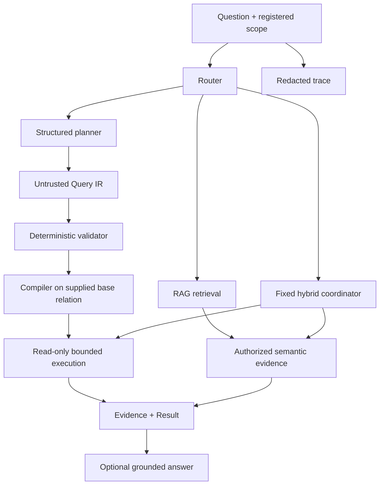

# Maglev

[English](README.md) | [简体中文](README.zh-CN.md) | [日本語](README.ja.md)

[](https://github.com/benjis/maglev/actions/workflows/ci.yml)
[](https://www.ruby-lang.org/)
[](https://rubyonrails.org/)
[](LICENSE.txt)

Maglev 0.2 is a Rails-native, read-only knowledge and query layer for
ActiveRecord applications. It lets an application answer natural-language
questions through three explicit routes:

- **Structured:** question → validated Query IR → composable
  `ActiveRecord::Relation` or bounded aggregate.
- **RAG:** question → authorized semantic retrieval → optional grounded answer.
- **Hybrid:** one of two fixed workflows combining structured filtering and RAG
  evidence.

Models expose only an application-defined allowlist. Structured compilation
starts from the caller's base relation and can only narrow it. RAG retrieval and
answer generation remain separable.

```ruby
# Exact database question
resource_authorizer = ->(_entry, user) { user.account_id == current_account.id }
result = current_account.invoices.maglev_request(
  "Open invoices over $500",
  mode: :structured,
  planner_adapter: planner,
  authorizer: resource_authorizer,
  user: current_user
)

# Inspectable semantic evidence, without generation
retrieval = SupportTicket.retrieve("customers blocked during cancellation", user: current_user)

# Grounded answer
answer = SupportTicket.ask("What cancellation problems recur?", user: current_user)
```

## Start here: choose the data path

You do not need to understand Maglev's whole architecture before using it. Start
with the kind of answer your application needs:

| User question | Data needed | Declare | Call |
| --- | --- | --- | --- |
| “How many invoices are overdue?” | Exact columns, filters, counts | `queryable` | `maglev_request(..., mode: :structured)` |
| “What problems do customers describe when cancelling?” | Free text, comments, attachments | `knowledge` | `retrieve` or `ask` |
| “Which open tickets mention being charged twice?” | Exact status plus semantic text | Both | `maglev_request(..., mode: :hybrid)` |

The mental model is deliberately small:

1. `maglev_resource :support_tickets` gives a model a stable name in Maglev.
2. `queryable` allowlists what a planner may ask ActiveRecord to filter, sort,
   join, or aggregate.
3. `knowledge` selects what becomes searchable semantic evidence.
4. The caller still supplies authorization and, for structured work, the base
   `ActiveRecord::Relation`. Maglev never grants itself broader access.

## Why Maglev?

- A normal Ruby gem with `Maglev::Railtie`, not a Rails Engine or separate API.
- ActiveRecord-first structured queries; no unrestricted SQL or Ruby generation.
- Explicit registry for queryable fields, associations, scopes, aggregates, and
  knowledge sources.
- Tenant and authorization constraints carried by application-owned relations.
- Source-aware RAG with pgvector, normalized similarity, deterministic budgets,
  and inspectable evidence.
- Immutable plans/results and redacted trace metadata.
- Deterministic fake adapters for tests; no live provider calls in the default suite.

## Architecture



The registry is an authority boundary. A schema snapshot contains only the
registered resources authorized for one request, never record values. Provider
output is untrusted until deterministic validation succeeds.

## Installation

Maglev requires Ruby 3.3+, Rails 7.1 or 8.0, PostgreSQL, and pgvector.

```ruby
# Gemfile
gem "maglev-rb", "~> 0.2.0"
```

```bash
bundle install
bin/rails generate maglev:install --embedding-dimensions=1536
bin/rails db:migrate
```

The generator creates an initializer, the `maglev_chunks` table, source and
tenant metadata, an HNSW cosine index, and `maglev_index_states` diagnostics.
Review generated migrations when owner primary keys are UUIDs.

## Configuration

The built-in embedding and generation clients use OpenAI-compatible HTTP
endpoints. The planner defaults to the OpenAI `json_schema` response format;
providers without that capability may use the less constrained `json_object`
format. Embedding and generation may use different providers.

```ruby
Maglev.configure do |config|
  config.embedding_provider do |provider|
    provider.url = ENV.fetch("MAGLEV_EMBEDDING_URL", "https://api.openai.com/v1")
    provider.api_key = ENV["MAGLEV_EMBEDDING_API_KEY"]
    provider.model = "text-embedding-3-small"
    provider.dimensions = 1536
  end

  config.generation_provider do |provider|
    provider.url = ENV.fetch("MAGLEV_GENERATION_URL", "https://api.openai.com/v1")
    provider.api_key = ENV["MAGLEV_GENERATION_API_KEY"]
    provider.model = "gpt-4.1-mini"
  end

  config.planner_adapter = Maglev::Adapters::FaradayPlanner.new
  # For providers without json_schema support:
  # config.planner_adapter = Maglev::Adapters::FaradayPlanner.new(response_format: :json_object)
  config.routing_adapter = MyRoutingAdapter.new # required only for mode: :auto

  config.chunk_size = 1000
  config.minimum_similarity = nil
  config.retrieval_max_candidates = 1000
  config.context_max_characters = 4000
  config.context_per_owner_characters = 1200

  config.snapshot_attribute_max_characters = 20_000
  config.snapshot_related_record_max_characters = 50_000
  config.snapshot_max_characters = 100_000
  config.snapshot_max_chunks = 100

  config.structured_query_timeout = 5
  config.structured_evidence_max_rows = 100
  config.structured_evidence_max_bytes = 32_768
end
```

Use custom `embedding_adapter`, `generation_adapter`, `planner_adapter`,
`routing_adapter`, `attachment_extractor`, or `authorization_adapter` objects
when the built-in protocols do not fit.

## Registering a resource

`maglev_resource` is the primary v0.2 DSL. Structured and knowledge capabilities
are independent and may be declared together or separately.

### A fully annotated structured resource

```ruby
class Invoice < ApplicationRecord
  # Normal Rails declarations remain the source of truth.
  belongs_to :account
  scope :due_before, ->(date) { where(due_on: ..date) }

  # :invoices is the stable identifier used by Maglev plans and requests.
  maglev_resource :invoices do
    # Help the planner understand what this resource represents.
    description "Invoices belonging to an authorized account"
    synonyms "bills"

    # This block controls structured ActiveRecord queries only.
    queryable do
      # Allow exact filters/sorts on these real database columns.
      # enum also tells the planner which status values are valid.
      field :status, enum: %w[draft open paid void]
      field :amount, description: "Invoice total in the account currency"
      field :due_on, synonyms: ["deadline"]
      field :paid_at

      # Explicitly deny sensitive columns, even if a planner asks for them.
      prohibit :number, :internal_note

      # Permit a registered join to the separately registered :accounts resource.
      association :account, resource: :accounts

      # Permit this existing Rails scope and describe its typed argument.
      scope :due_before,
        parameters: {date: {type: :date, required: true}}

      # Allow only these aggregate functions/columns.
      aggregates count: true, sum: [:amount], average: [:amount]

      # Per-resource ceilings applied in addition to global/request limits.
      limits rows: 50, operations: 8, joins: 1

      # The caller must authorize this resource for every structured plan.
      authorization :required
    end

    # This separate block controls semantic indexing and RAG.
    # Repeating a field here does not broaden structured query permissions.
    knowledge do
      expose :status, :amount, :due_on, :paid_at
    end
  end
end
```

Nothing is exposed implicitly. `authorization :required` means the resource is
omitted from a request schema snapshot unless the caller authorizes it.
`allow_unscoped_model_queries` is opt-in and should be reserved for genuinely
public data.

`queryable` defines only the constrained ActiveRecord contract. `knowledge`
defines only RAG indexing and retrieval sources. `maglev_resource` is the
unified resource declaration and may contain either block or both. Models that
do not declare `knowledge` cannot use `search`, `retrieve`, `ask`, snapshots, or
indexing callbacks.

Read the declaration as an allowlist, not as a schema dump. Columns that are not
listed in `field` cannot appear in Query IR. Values that are not listed in
`expose` (or another knowledge source) do not enter the semantic snapshot.

### Why a field may appear in both blocks

The same column can serve two different jobs:

- `field :status` lets structured queries apply an exact condition such as
  `status = "open"`.
- `expose :status` writes `status: open` into the indexed snapshot so retrieved
  evidence keeps useful context.

Declaring one never implies the other. Put identifiers, dates, enums, and money
in `queryable` when exactness matters. Put prose, descriptions, comments,
resolution notes, and attachment text in `knowledge` when meaning matters. Use
both for contextual fields such as status, priority, or product area.

### A realistic RAG resource

RAG is most useful when the answer is present in human language rather than a
single database column. In this example, structured queries can find open/high
priority tickets, while RAG can understand phrases such as “charged twice” in
ticket bodies, comments, resolution notes, and attached logs.

```ruby
class SupportTicket < ApplicationRecord
  belongs_to :account
  has_many :comments
  has_many_attached :files
  has_rich_text :resolution

  maglev_resource :support_tickets do
    description "Customer support requests and their investigation evidence"

    queryable do
      # Good structured fields: exact, typed, and useful for filtering.
      field :status, enum: %w[open pending resolved closed]
      field :priority, enum: %w[low normal high urgent]
      field :product_area
      field :created_at
      prohibit :requester_email, :internal_notes
      limits rows: 100, operations: 8, joins: 1
      authorization :required
    end

    knowledge do
      # Prose carries the semantic meaning that exact filters cannot capture.
      expose :subject, :body

      # These overlap with queryable fields to preserve context in evidence.
      expose :status, :priority, :product_area

      # Include a bounded, deterministic slice of related conversation.
      include_related :comments, depth: 1, limit: 20,
        order: {created_at: :desc}

      # Extract supported attachment text and Action Text content.
      expose_attached :files
      expose_rich_text :resolution
    end
  end
end
```

Related models used by `include_related` must declare their own
`maglev_resource ... knowledge` block. To create a knowledge-only resource,
simply omit `queryable`; to create a structured-only resource, omit `knowledge`.

Once records are indexed, these calls answer different questions:

```ruby
# Semantic matches only. No generation call is made.
evidence = SupportTicket.retrieve(
  "customers say they were charged twice after cancellation",
  limit: 10,
  user: current_user
)

# A prose answer grounded in the selected ticket evidence.
answer = SupportTicket.ask(
  "What double-charge patterns recur after cancellation?",
  limit: 5,
  user: current_user
)

# Exact database filtering followed by semantic retrieval inside that set.
result = current_account.support_tickets.maglev_request(
  "Open urgent tickets where customers describe being charged twice",
  mode: :hybrid,
  hybrid_plan: :structured_first,
  planner_adapter: planner,
  authorizer: resource_authorizer,
  user: current_user
)
```

The default attachment extractor supports plain text, Markdown, HTML, and XHTML.
PDF, Office, OCR, image, audio, and video parsing require an application-owned
extractor. All snapshots, relations, attachments, and chunks have hard budgets.

Inspect exposure without calling a provider:

```ruby
SupportTicket.maglev_schema
ticket.maglev_snapshot
ticket.maglev_context_preview(question: "Why is this unresolved?")
ticket.maglev_index_status
```

### DSL reference

Resource-level methods:

| DSL | Purpose |
| --- | --- |
| `maglev_resource :identifier` | Registers one stable resource identifier for the model. |
| `description "..."` | Human-readable planner context; never contains record values. |
| `synonyms "...", "..."` | Alternate names the planner may use for the resource. |
| `queryable { ... }` | Declares the structured ActiveRecord capability. May appear once. |
| `knowledge { ... }` | Declares the RAG/indexing capability. May appear once. |

`queryable` methods:

| DSL | Purpose and options |
| --- | --- |
| `field :name` | Allowlists a real column. Options: `description:`, `synonyms:`, `enum:`, and `sensitive:`. A sensitive field is excluded from the planner schema. |
| `prohibit :a, :b` | Explicitly denies real columns. A field cannot be both allowed and prohibited. |
| `association :account, resource: :accounts` | Allows a registered ActiveRecord association path. Options: `description:` and `synonyms:`. The target resource must also be registered. |
| `scope :due_before, parameters: {...}` | Allows one existing model scope. Parameter metadata supports `type`, `required`, `nullable`, `enum_values`, `minimum`, and `maximum`. Arbitrary scopes are never callable. |
| `aggregates count: true, sum: [:amount]` | Allows `count`, `sum`, `average`, `minimum`, or `maximum`; field lists restrict numeric/value aggregates. |
| `limits rows:, operations:, joins:` | Adds positive per-resource ceilings. Effective limits are the strictest configured limits. |
| `authorization :required` | Default. The resource enters a schema snapshot only when `authorizer` approves it. |
| `authorization :public` | Marks the resource schema public; record access must still respect the supplied relation. |
| `allow_unscoped_model_queries true` | Allows structured requests without a supplied base relation. Off by default; use only for genuinely public data. |

Scope parameter `type` accepts `:string`, `:integer`, `:float`, `:decimal`,
`:boolean`, `:date`, `:datetime`, `:timestamp`, or `:time`. Unsupported types
are rejected when the resource is registered.

`knowledge` methods:

| DSL | Purpose and options |
| --- | --- |
| `expose :subject, :body` | Adds selected non-nil model attributes to the searchable snapshot. |
| `hide :internal_notes` | Explicitly documents attributes that must not be exposed; an attribute cannot be both exposed and hidden. |
| `tags :support, :customer` | Adds fixed classification labels to every snapshot for this model. |
| `include_related :comments, depth:, limit:` | Adds bounded related-record snapshots. Optional `inverse:` resolves non-obvious reverse associations; `order:` accepts a column or `{column: :asc/:desc}`. |
| `expose_attached :files` | Adds text extracted from named Active Storage attachments. |
| `expose_rich_text :resolution` | Adds plain text from named Action Text attributes. |

Nothing is inferred from database visibility. DSL declarations are validated at
registration time, and unknown fields, associations, scopes, or attachments
raise `Maglev::ConfigurationError`.

## Structured queries

Planning and execution are deliberately separate.

```ruby
base = current_account.invoices.where(archived: false)

plan = Maglev.plan(
  "Open invoices over $500 due this month",
  resource: :invoices,
  base_relation: base,
  authorizer: ->(entry, user) { user.account_id == current_account.id },
  user: current_user,
  constraints: {rows: 25, operations: 8, joins: 1},
  adapter: planner
)

plan.status                # :ready, :clarification_required, :unsupported, :invalid
plan.ir                    # immutable Maglev::QueryIR::Query when ready
plan.explanation
plan.policy_limits         # effective rows/operations/joins/complexity limits
plan.evidence_requirements
plan.trace_id

result = Maglev.execute(plan)
result.status              # :succeeded
result.kind                # :relation or :aggregate
result.value               # protected ActiveRecord::Relation or bounded scalar
result.evidence            # bounded Maglev::StructuredEvidence
result.render
```

Record relations stay lazy and composable until read. Reads execute in a
read-only PostgreSQL transaction with `statement_timeout`; returned records are
read-only and bulk writes are rejected.

Query IR v1 supports registered scopes; `eq`, `not_eq`, `gt`, `gte`, `lt`,
`lte`, `in`, `not_in`, `is_null`, `is_not_null`, and `between`; joins up to two
levels; sort, distinct, limit; and count, sum, average, minimum, and maximum.
It cannot contain SQL, Arel, Ruby, arbitrary methods, writes, locks, nested
boolean groups, windows, subqueries, `HAVING`, or planner-defined tools.

## RAG: search, retrieve, and ask

These APIs remain directly available on knowledge-enabled models.

```ruby
matches = SupportTicket.search(
  "cancellation failures",
  limit: 10,
  minimum_similarity: 0.65,
  user: current_user
)

matches.first.owner
matches.first.source_identity
matches.first.source_type
matches.first.similarity
```

`search` returns at most one `SearchResult` per owner. For full retrieval
diagnostics without generation, use `retrieve`:

```ruby
retrieval = SupportTicket.retrieve(
  "cancellation failures",
  limit: 10,
  chunks_per_owner: 2,
  user: current_user
)

retrieval.considered
retrieval.selected
retrieval.rejected
retrieval.context
retrieval.budgets
retrieval.reasons
retrieval.timings
retrieval.trace_id
```

Generate only when a prose answer is needed:

```ruby
answer = SupportTicket.ask(
  "Which cancellation failures recur?",
  limit: 5,
  chunks_per_owner: 2,
  minimum_similarity: 0.65,
  user: current_user
)

answer.text
answer.sources
answer.metadata
```

If no evidence survives authorization, similarity, or context budgets, `ask`
returns deterministic insufficient context without calling generation.

## Unified requests and routing

Use `Maglev.request`, `Model.maglev_request`, or
`relation.maglev_request` when one result envelope and route selection are useful.

```ruby
result = current_account.invoices.maglev_request(
  "How many open invoices are overdue?",
  mode: :structured,
  planner_adapter: planner,
  authorizer: resource_authorizer,
  user: current_user
)

result.status
result.route
result.kind
result.value
result.evidence
result.warnings
result.trace_id
result.confidence
result.reasons
result.metadata
```

Modes are `:structured`, `:rag`, `:hybrid`, and `:auto`. Explicit modes never
call the routing classifier. Automatic routing requires `routing_adapter` and
receives only bounded capability summaries—not record values or source text.
Every application-level request must name resources/models or supply a base
relation; Maglev never scans all application models.

A routing adapter implements `classify(question:, capabilities:)` and returns
`{"route" => "structured", "confidence" => 0.9, "reasons" => ["exact fields"]}`
or another valid route. Confidence is advisory and never grants access.

For a generated RAG answer through the unified API, pass `answer: true`.
Otherwise the RAG route returns `kind: :semantic_matches`.

## Hybrid workflows

Hybrid mode supports exactly two fixed shapes and requires one registered
resource with both queryable and knowledge capabilities.

```ruby
result = current_account.support_tickets.maglev_request(
  "Open tickets that mention cancellation",
  mode: :hybrid,
  hybrid_plan: :structured_first, # or :rag_first
  planner_adapter: planner,
  authorizer: resource_authorizer,
  candidate_limit: 100,
  user: current_user
)

result.kind                      # :hybrid_answer
result.value.records
result.evidence                  # structured/RAG provenance envelopes
result.metadata[:plan_shape]
result.metadata[:operations]
```

Structured-first filters records before retrieval. RAG-first retrieves candidate
owners and then verifies them through the authorized relation. Candidate handoff
uses typed primary keys, is bounded, and reapplies registration, tenant, base
relation, and authorization constraints at every stage. There are no loops or
autonomous tool calls.

## Authorization and tenancy

The base relation is the structured and hybrid authority boundary:

```ruby
# Plain tenant scope
current_account.invoices.maglev_request(
  question, mode: :structured, authorizer: resource_authorizer, user: current_user
)

# Pundit
policy_scope(Invoice).maglev_request(
  question, mode: :structured, authorizer: resource_authorizer, user: current_user
)

# CanCanCan
Invoice.accessible_by(current_ability).maglev_request(
  question, mode: :structured, authorizer: resource_authorizer, user: current_user
)
```

RAG authorization uses an optional adapter:

```ruby
class MaglevAuthorization
  def scope(model:, user:) = model.where(account_id: user.account_id)
  def authorize(record:, user:) = record.account_id == user.account_id
end

Maglev.configure do |config|
  config.authorization_adapter = MaglevAuthorization.new
  config.tenant_id_resolver = lambda do |record: nil, user: nil|
    (record || user)&.account_id&.to_s
  end
end
```

Without an RAG authorization adapter, records are allowed by default. Configure
one and pass `user:` for every user-scoped retrieval.

Authorization filters are pushed into storage when supported and every hydrated
record is rechecked. Authorization scopes exceeding 1,000 owner IDs fail closed.

## Indexing, upgrades, and operations

```bash
bin/rails maglev:status
bin/rails maglev:reindex[SupportTicket]
bin/rails maglev:reindex_all
bin/rails maglev:evaluate_planner
```

Callbacks enqueue `Maglev::ReindexJob` after relevant commits. Indexing is
idempotent, reuses unchanged chunks, atomically replaces one owner's searchable
generation, and records safe status/failure diagnostics.

Applications upgrading from 0.1.x should follow [CHANGELOG.md](CHANGELOG.md):

```bash
bin/rails generate maglev:upgrade_index_version
bin/rails generate maglev:upgrade_source_identity
bin/rails db:migrate
bin/rails maglev:reindex_all
```

Review generated migrations, migrate the vector column separately when embedding
dimensions change, rebuild the HNSW index, and complete a full reindex. Old rows
remain unavailable until they carry the current index identity.

### Index identity and safe replacement

Every chunk stores an `index_version`. Fingerprint format version 1 uses the
`maglev-index` namespace and covers the embedding model/dimensions, adapter ID
and version, chunking algorithm/size, and `application_index_version`. Custom
embedding adapters implement `maglev_adapter_id` and `maglev_adapter_version`,
or configure `embedding_adapter_id` and `embedding_adapter_version`.

The `upgrade_index_version` migration intentionally adds a nullable
`index_version`. Legacy rows are unavailable until a full reindex gives them the
current identity. Migrate the vector dimension before reindexing. A failed owner
replacement preserves the previous complete generation.

## Vector-store contract

PostgreSQL/pgvector is the production default; `Maglev::VectorStores::Memory` is
for tests and local experiments. A custom store implements `fetch(ids:)`,
`upsert(documents:)`, `search(vector:, filters:, limit:)`, `delete(ids:)`,
`delete_by_owner(owner_type:, owner_id:)`, atomic
`replace_owner(owner_type:, owner_id:, documents:)`, `healthcheck`, and
`capabilities`.

`delete_by_owner` followed by `upsert` is not an atomic replacement. Concurrent
replacement and deletion for one owner must be linearizable, and failed
replacement must preserve the previous complete generation.

## Traces, evidence, and safety boundaries

Maglev results carry bounded evidence and a trace ID. Traces record identifiers,
decisions, operation names, limits, safe timings, warnings, and error classes.
They exclude record values, source text, prompts, secrets, and raw provider
payloads by default. The host application owns audit persistence and retention.

Maglev 0.2 does **not** provide:

- natural-language writes or mutations;
- unrestricted SQL, Ruby, Arel, scopes, or code execution;
- autonomous/iterative agents;
- a Rails Engine, REST API, admin UI, or mandatory frontend;
- built-in PDF/Office/OCR/audio parsing;
- streaming or conversation memory;
- Qdrant or another required external vector service.

Retrieved documents are evidence, never instructions that can change route,
permissions, Query IR, or execution policy.

## Runtime support and development

| Component | Supported |
| --- | --- |
| Ruby | 3.3, 4.0 |
| Rails | 7.1, 8.0 |
| Database | PostgreSQL with pgvector |

```bash
bundle exec rspec
bundle exec standardrb
bundle exec rubocop
bundle exec rake build
bundle exec rake maglev:release_audit
```

The default suite uses deterministic fakes and never calls a live LLM or
embedding provider.

## License

Maglev is available under the [MIT License](LICENSE.txt).
