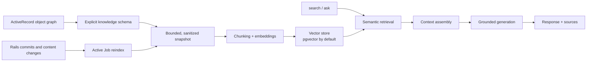

# Maglev

[English](README.md) | [简体中文](README.zh-CN.md)

[](https://github.com/benjis/maglev/actions/workflows/ci.yml)
[](https://www.ruby-lang.org/)
[](https://rubyonrails.org/)
[](LICENSE.txt)

**Give your Rails models semantic memory, without building a second application beside Rails.**

Maglev is a Rails-native semantic knowledge layer for ActiveRecord object graphs. Declare which parts of your domain are safe and useful to understand, and Maglev turns records, relationships, attachments, and rich text into searchable knowledge. It keeps that knowledge fresh through normal Rails lifecycle hooks and gives you semantic search and grounded answers through familiar model APIs.

```ruby
Product.search("laptops with battery or usability complaints")

response = Product.ask("What recurring product issues should we investigate?", user: current_user)
response.text
response.sources # the ActiveRecord records and chunks behind the answer
```

Maglev is deliberately focused on retrieval-augmented generation (RAG). ActiveRecord remains the source of truth for exact filters, joins, reporting, and aggregation; Maglev handles questions expressed in human language.

## Why Maglev?

- **Rails-native:** a gem and Railtie, not a separate service, engine, or API.
- **Model-driven:** declare knowledge next to the ActiveRecord model that owns it.
- **Graph-aware:** traverse direct, `has_many :through`, and polymorphic associations with explicit depth and record limits.
- **Fresh by default:** reindex owners after declared records, direct associations, attachments, or Action Text content change.
- **Grounded:** answers are generated only from retrieved context and include their sources.
- **Production-minded:** authorization hooks, content limits, sanitization, retries, instrumentation, and idempotent reindexing are built in.
- **Extensible:** use the default PostgreSQL/pgvector store or implement the small vector-store contract.

## Quick Start

### 1. Install prerequisites

Maglev requires Ruby 3.2+, Rails 7.1 or 8.0, PostgreSQL, and the
[`pgvector`](https://github.com/pgvector/pgvector) extension.

Add Maglev to your application:

```ruby
# Gemfile
gem "maglev-rb"
```

```bash
bundle install
bin/rails generate maglev:install --embedding-dimensions=1536
bin/rails db:migrate
```

The generator writes `--embedding-dimensions` to both `config/initializers/maglev.rb` and the `maglev_chunks` vector column, and includes a cosine HNSW index.

### 2. Configure your provider

```ruby
# config/initializers/maglev.rb
Maglev.configure do |config|
  config.embedding_provider do |provider|
    provider.url = "http://localhost:11434/v1"
    provider.api_key = ENV["LOCAL_EMBEDDING_API_KEY"]
    provider.model = "Qwen3-Embedding-0.6B-8bit"
    provider.dimensions = 1024
  end

  config.generation_provider do |provider|
    provider.url = "https://api.deepseek.com/v1"
    provider.api_key = Rails.application.credentials.dig(:deepseek_api_key)
    provider.model = "deepseek-chat"
  end

  config.chunk_size = 1000
end
```

Embedding and generation endpoints are independent and may use different URLs, API keys, and models. The built-in adapters call OpenAI-compatible `/embeddings` and `/chat/completions` endpoints and expect the corresponding OpenAI-compatible JSON response shapes. They do not provide a model registry or native Anthropic, Gemini, or other provider protocols; inject custom Maglev adapters when another protocol is required.

For an existing installation, change the configured dimensions and the database vector column together. Maglev checks their consistency before requesting an embedding.

### 3. Declare model knowledge

```ruby
class Product < ApplicationRecord
  has_many :reviews, inverse_of: :product
  has_many :product_categories, inverse_of: :product
  has_many :categories, through: :product_categories
  has_many_attached :images
  has_rich_text :description

  has_knowledge do
    expose :name, :sku, :price, :status
    tags :product

    include_related :reviews, depth: 1, limit: 10
    include_related :categories, depth: 1, limit: 10, inverse: :products

    expose_attached :images
    expose_rich_text :description
  end
end

class Review < ApplicationRecord
  belongs_to :product, inverse_of: :reviews

  has_knowledge do
    expose :rating, :title, :body
  end
end
```

Only explicitly exposed fields and content sources enter Maglev's knowledge snapshot. Relation `limit` bounds the number of records per association. Relation `depth` bounds association hops: `depth: 1` includes the directly related record but does not expand that record's relations. `config.max_relation_depth` is the hard root-to-leaf ceiling for every snapshot. Related models define their own exposed knowledge, so sensitive join-model fields are not flattened accidentally.

### 4. Index existing records

New and updated records enqueue `Maglev::ReindexJob` automatically. Backfill existing data once after installation:

```bash
bin/rails maglev:reindex[Product]
# or every model that declares has_knowledge
bin/rails maglev:reindex_all
```

Make sure your Active Job backend is running in production.

### 5. Search and ask

```ruby
results = Product.search(
  "laptops with battery or usability complaints",
  limit: 10,
  user: current_user
)

results.each do |result|
  result.owner       # => Product
  result.content     # retrieved snapshot chunk
  result.source      # => "snapshot"
  result.distance    # cosine distance; lower is closer
  result.similarity  # normalized convenience score
end
```

Generate an answer grounded in the retrieved records:

```ruby
response = Product.ask(
  "What recurring product issues should the merchandising team investigate?",
  limit: 5,
  user: current_user
)

response.text
response.sources # owner, chunk, distance, and the exact retrieved content
response.metadata
```

For example, an answer might summarize a loud fan, intermittent trackpad responsiveness, and lower-than-advertised battery life from retrieved review content. Treat it as a summary of the retrieved context—not an aggregate over every product—and use `response.sources` to show the evidence behind each conclusion.

Instance-level questions stay scoped to one owner:

```ruby
product.ask("Summarize the reported strengths and weaknesses of this product.", user: current_user)
```

Maglev also follows declared relationships when Rails data changes. Moving a review queues reindexing for both the previous and current product after commit, so their searchable knowledge stays current:

```ruby
review.update!(product: replacement_product)
# Maglev::ReindexJob is queued for both affected products.
```

When retrieval yields no usable context, Maglev returns a deterministic insufficient-context response instead of asking the model to improvise.

## How It Works



1. `has_knowledge` compiles an explicit schema for a model and its declared relationships.
2. Maglev builds a deterministic text snapshot from allowed attributes, related records, attachments, rich text, and tags.
3. The snapshot is split into bounded chunks and embedded through the configured adapter.
4. Chunks are upserted into a vector store. The default store persists them in PostgreSQL using pgvector.
5. `search` embeds the query and performs cosine nearest-neighbor retrieval.
6. `ask` assembles retrieved chunks within context budgets, builds a grounded prompt, and returns the answer with source metadata.
7. Rails callbacks propagate declared record changes through the graph and enqueue reindexing for affected owners.

Maglev does not duplicate your relational model. Vector documents point back to their ActiveRecord owners; your application remains responsible for transactions, business rules, and structured queries.

## Knowledge Sources

### ActiveRecord graphs

`include_related` supports bounded traversal across ordinary associations, `has_many :through`, and polymorphic relationships. Use `inverse:` when Maglev cannot infer how changes on a related model should find their owning knowledge record.

```ruby
has_knowledge do
  include_related :tickets, depth: 2, limit: 25
  include_related :events, depth: 1, limit: 20, inverse: :eventable
end
```

When a related record moves between owners, Maglev reindexes both the previous and current owner.

Creating, deleting, or reassigning a join row changes a `has_many :through` relationship without changing the related record itself. After such join-model changes, explicitly enqueue or run owner reindexing from your application.

### Active Storage and Action Text

```ruby
has_knowledge do
  expose_attached :contracts, :brief
  expose_rich_text :notes
end
```

HTML and Action Text content are sanitized before indexing. Attachments are constrained by content type, byte size, and extracted character count. Changes to declared attachments and rich text trigger owner reindexing.

### Inspect before indexing

The developer experience APIs let you inspect exactly what a model exposes without calling an embedding or generation provider:

```ruby
Customer.maglev_schema
customer.maglev_snapshot

preview = customer.maglev_context_preview(
  question: "Why is this customer at risk?"
)
preview.text
preview.metadata # includes provider_calls: 0
```

## Authorization

Maglev is policy-library agnostic. Configure a small adapter to apply your application's authorization rules during retrieval and answering:

```ruby
class MaglevAuthorization
  def scope(model:, user:)
    model.accessible_by(user)
  end

  def authorize(record:, user:)
    record.account_id == user.account_id
  end
end

Maglev.configure do |config|
  config.authorization_adapter = MaglevAuthorization.new
end
```

The adapter must implement:

- `scope(model:, user:)`, returning the records visible to the user.
- `authorize(record:, user:)`, returning `false` to deny a record.

Without an adapter, all records are allowed. Pass `user:` consistently anywhere retrieval must be scoped.

`customer.explain` is a convenience API for applications without user-scoped authorization; use `customer.ask(Maglev.configuration.explain_question, user: current_user)` when a user context is required. Authorization scopes apply to the default pgvector retrieval path. See [Vector Stores](#vector-stores) before combining direct `search` calls with a custom store.

## Configuration

```ruby
Maglev.configure do |config|
  config.embedding_provider do |provider|
    provider.url = ENV.fetch("MAGLEV_EMBEDDING_URL", "https://api.openai.com/v1")
    provider.api_key = ENV["MAGLEV_EMBEDDING_API_KEY"]
    provider.model = "text-embedding-3-small"
    provider.dimensions = 1536
  end

  config.generation_provider do |provider|
    provider.url = ENV.fetch("MAGLEV_GENERATION_URL", "https://api.openai.com/v1")
    provider.api_key = ENV["MAGLEV_GENERATION_API_KEY"]
    provider.model = "gpt-4.1-mini"
  end

  config.chunk_size = 1000

  config.context_max_characters = 4000
  config.context_per_owner_characters = 1200
  config.max_relation_depth = 3

  config.attachment_allowed_content_types = [
    "text/plain",
    "text/markdown",
    "text/html"
  ]
  config.attachment_max_bytes = 5 * 1024 * 1024
  config.attachment_max_characters = 20_000

  config.provider_max_attempts = 2
  config.provider_timeout = 30
  config.logger = Rails.logger
end
```

`provider_timeout` applies to each provider attempt. Timed-out attempts are retryable and count toward `provider_max_attempts`.

The built-in provider implementation is intentionally a thin OpenAI-compatible HTTP bridge. It supports embeddings and non-streaming chat completions only; streaming, tool calling, multimodal requests, structured output, and provider-specific model discovery are outside the current RAG-only release.

Inject custom `embedding_adapter`, `generation_adapter`, `attachment_extractor`, `authorization_adapter`, or `source_redactor` objects when your application needs different provider or policy behavior. Tests can use deterministic adapters without making network calls.

## Vector Stores

PostgreSQL with pgvector is the default production path. Maglev also exposes a compact backend contract for applications that need another store:

```ruby
class MyVectorStore < Maglev::VectorStores::Base
  def upsert(documents:)
    # Persist or replace documents by document.id
  end

  def search(vector:, filters:, limit:)
    # Return nearest Maglev::VectorStores::Document objects
  end

  def delete(ids:)
    # Delete documents with these stable IDs
  end

  def delete_by_owner(owner_type:, owner_id:)
    # Delete every document belonging to this owner
  end

  def healthcheck = :ok
  def capabilities = {metadata_filtering: true}
end

Maglev.configure do |config|
  config.vector_store = MyVectorStore.new
end
```

`Maglev::VectorStores::Memory` is useful for tests and local experiments. Custom stores should preserve document metadata filtering and stable document identity semantics.

Custom vector stores currently receive model and owner metadata filters, but not the configured authorization scope. `ask` still authorizes retrieved owners individually; direct `search(..., user:)` with a custom store must not be treated as authorization-filtered. Apply tenant or policy filtering inside the custom store, or use the default pgvector path when authorization-scoped search is required.

## Operations and Observability

```bash
bin/rails maglev:status
bin/rails maglev:reindex[Customer]
bin/rails maglev:reindex_all
```

Reindexing is safe to repeat: unchanged chunks are reused and obsolete chunks are removed. Maglev emits ActiveSupport notifications for indexing start/success/failure, retrieval, generation, and provider retries:

```ruby
ActiveSupport::Notifications.subscribe(/\Amaglev\./) do |name, start, finish, id, payload|
  Rails.logger.info(
    event: name,
    duration_ms: ((finish - start) * 1000).round(1),
    **payload
  )
end
```

## Security and Boundaries

- Treat extracted content as untrusted context. Maglev sanitizes supported HTML sources, but authorization and model exposure remain application responsibilities.
- Expose only fields and content sources that are appropriate to send to your configured providers.
- Default attachment limits are 5 MiB and 20,000 extracted characters; the default allowlist covers plain text, Markdown, HTML, and XHTML.
- The generated v1 migration uses `bigint` owner IDs. UUID-backed owners require a customized migration.
- Maglev is RAG-only. It does not generate SQL, answer aggregate questions through database computation, expose REST endpoints, provide an admin UI, run agents, or manage conversation memory.

## Compatibility

The CI matrix tests:

| | Supported |
|---|---|
| Ruby | 3.2, 3.3 |
| Rails | 7.1, 8.0 |
| Database | PostgreSQL with pgvector |

Versions outside this matrix may work but are not currently guaranteed.

## Development

```bash
bundle install

# PostgreSQL + pgvector integration tests
MAGLEV_REQUIRE_POSTGRESQL=true MAGLEV_DATABASE=maglev_test bundle exec rspec

bundle exec standardrb
bundle exec rubocop
bundle exec rake build
```

The default test suite uses deterministic fake adapters and never calls a live LLM or embedding provider.

## License

Maglev is available as open source under the [MIT License](LICENSE.txt).
