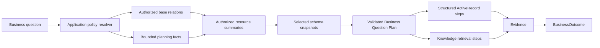

# Maglev

Maglev is a Rails-native, read-only knowledge and query layer for
ActiveRecord applications.

It helps an existing Rails application answer business questions such as:

- "How many overdue invoices do we have by account tier?"
- "Which customer issues are most common among accounts at risk of churn?"
- "What changed in revenue this quarter, and what are customers saying about it?"

The caller asks one natural-language question. The application decides which
records are authorized. Maglev learns the available structure from Active
Record, gathers bounded structured and semantic Evidence, and returns one
`BusinessOutcome`.

```ruby
outcome = Maglev.ask(
  "Which customer issues are affecting renewals?",
  user: current_user,
  context: {locale: "en-AU"}
)
```

The caller does **not** choose structured, RAG, or hybrid mode. That is an
internal planning decision, not something a business user should need to
understand.

> **Pre-1.0 compatibility:** minor releases may contain breaking changes.
> v0.3 intentionally removes incompatible v0.2 declarations and entrypoints
> instead of preserving compatibility aliases.

## Contents

- [Why Maglev exists](#why-maglev-exists)
- [How Maglev thinks about your application](#how-maglev-thinks-about-your-application)
- [Quick start](#quick-start)
- [Registering resources](#registering-resources)
- [Structured policy: `queryable`](#structured-policy-queryable)
- [Knowledge policy: `knowledge`](#knowledge-policy-knowledge)
- [Authorization and tenancy](#authorization-and-tenancy)
- [Asking questions](#asking-questions)
- [BusinessOutcome](#businessoutcome)
- [Multiple resources and hybrid questions](#multiple-resources-and-hybrid-questions)
- [Lower-level structured and retrieval APIs](#lower-level-structured-and-retrieval-apis)
- [Indexing and reindexing](#indexing-and-reindexing)
- [Configuration reference](#configuration-reference)
- [DSL reference](#dsl-reference)
- [Terminology](#terminology)
- [Security model and product boundaries](#security-model-and-product-boundaries)

## Why Maglev exists

Rails applications already contain years of business meaning:

- models and associations describe the object graph;
- columns and enums describe structured facts;
- scopes encode useful, application-owned filters;
- authorization rules define which records a user may see;
- Action Text, Active Storage, notes, descriptions, and comments contain
  unstructured knowledge.

Traditional RAG ignores most of that structure. A generic text-to-SQL system
ignores most of the unstructured knowledge. Re-declaring the entire model in a
second AI-specific schema creates drift and makes adoption expensive.

Maglev takes a different approach:

1. **Reflect structure.** Active Record remains the source of truth for physical
   columns, enums, and associations.
2. **Declare policy, not a duplicate schema.** Developers describe what Maglev
   may use, what it must never use, and which existing scopes are safe.
3. **Keep structured and knowledge exposure independent.** A field useful in a
   database filter is not automatically useful or appropriate for semantic
   indexing.
4. **Start from an authorized relation.** Every question is constrained by an
   application-supplied `ActiveRecord::Relation`.
5. **Plan bounded work.** Provider output is validated data, never executable
   code, unrestricted SQL, or an open-ended agent loop.
6. **Return Evidence, not just prose.** Findings are grounded in Evidence;
   inferences and recommendations remain visibly separate.

Maglev is designed for adding useful business intelligence to existing Rails
applications without turning those applications into agent runtimes.

## How Maglev thinks about your application


```mermaid
flowchart LR
    Q["Business question"] --> P["Application policy resolver"]
    P --> AR["Authorized base relations"]
    P --> F["Bounded planning facts"]
    AR --> C["Authorized resource summaries"]
    F --> C
    C --> S["Selected schema snapshots"]
    S --> B["Validated Business Question Plan"]
    B --> SQ["Structured ActiveRecord steps"]
    B --> KQ["Knowledge retrieval steps"]
    SQ --> E["Evidence"]
    KQ --> E
    E --> O["BusinessOutcome"]
```

The important boundaries are:

- `maglev_resource` explicitly registers a model.
- Reflection discovers structure; discovery does not grant record access.
- `queryable` governs structured querying.
- `knowledge` separately opts content into semantic indexing and retrieval.
- `policy_resolver` decides which records are available for the current request.
- Maglev exposes only bounded, authorized schema snapshots to planning.
- A fixed Business Question Plan is validated before execution and cannot grow
  new steps at runtime.

## Quick start

This walkthrough intentionally starts with one resource. A single authorized
resource does not require a resource-selector adapter, so it is the shortest
path to a working question.

### 1. Requirements

- Ruby 3.3 or newer
- Rails 7.1 or 8.x
- PostgreSQL
- the pgvector PostgreSQL extension

Maglev is a normal gem with `Maglev::Railtie`; it is not a Rails Engine.

### 2. Install the gem

Add Maglev to your `Gemfile`:

```ruby
gem "maglev-rb"
```

Then install it:

```bash
bundle install
bin/rails generate maglev:install --embedding-dimensions=1536
bin/rails db:migrate
```

The generator creates:

- `config/initializers/maglev.rb`;
- the pgvector-backed `maglev_chunks` table;
- index-state and index-generation tables used by indexing operations.

The vector column dimension is fixed by the migration. It must match the
embedding dimension configured in the initializer.

### 3. Configure providers and planning

The built-in HTTP adapters use an OpenAI-compatible embeddings and chat
completions API. You can replace each adapter independently.

```ruby
# config/initializers/maglev.rb
Maglev.configure do |config|
  config.embedding_provider do |provider|
    provider.url = ENV.fetch("MAGLEV_EMBEDDING_URL", "https://api.openai.com/v1")
    provider.api_key = ENV.fetch("MAGLEV_EMBEDDING_API_KEY")
    provider.model = "text-embedding-3-small"
    provider.dimensions = 1536
  end

  config.generation_provider do |provider|
    provider.url = ENV.fetch("MAGLEV_GENERATION_URL", "https://api.openai.com/v1")
    provider.api_key = ENV.fetch("MAGLEV_GENERATION_API_KEY")
    provider.model = "gpt-4.1-mini"
  end

  config.embedding_adapter = Maglev::Adapters::FaradayEmbedding.new
  config.generation_adapter = Maglev::Adapters::FaradayGeneration.new
  config.planner_adapter = Maglev::Adapters::FaradayPlanner.new

  config.continuation_secret = Rails.application.secret_key_base
  config.continuation_store = Maglev::InMemoryContinuationStore.new
end
```

`InMemoryContinuationStore` is suitable for development and a single-process
demo. A multi-process production deployment should provide a shared store whose
`register(nonce, expires_at)` and `consume(nonce, now)` operations enforce
one-time consumption atomically.

### 4. Register a model

Assume the application already has this model and database schema:

```ruby
class SupportTicket < ApplicationRecord
  enum :status, {open: 0, investigating: 1, resolved: 2}
  enum :priority, {low: 0, normal: 1, high: 2, urgent: 3}

  scope :opened_since, ->(time) { where(created_at: time..) }

  maglev_resource do
    description "Customer support cases and their resolution history"
    synonyms "case", "customer issue"

    queryable do
      # The first `field` switches field exposure to allowlist mode.
      field :status
      field :priority
      field :customer_id
      field :created_at
      field :resolved_at

      scope :opened_since,
        parameters: {
          time: {type: :datetime, required: true}
        },
        description: "Tickets opened at or after a timestamp"

      limits rows: 100, groups: 30, operations: 8, joins: 1
    end

    knowledge do
      # Content is embedded.
      content :subject, :description, :resolution

      # Context is stored with Evidence but is not embedded.
      context :status, :priority, :created_at
    end
  end
end
```

`maglev_resource` without an argument derives the identifier from the Rails
route key. For example, `SupportTicket` becomes `support_tickets`, and a
namespaced model receives its namespaced route key. You may pass an explicit
stable identifier:

```ruby
maglev_resource :cases do
  # ...
end
```

### 5. Authorize the resource

The policy resolver is application code. It runs for every high-level question
and returns only resources the caller may use:

```ruby
Maglev.configuration.policy_resolver = lambda do |user:, context:|
  {
    support_tickets: {
      base_relation: user.account.support_tickets,
      planning_facts: {
        locale: context.fetch(:locale, "en"),
        timezone: context.fetch(:timezone, "UTC")
      }
    }
  }
end
```

The resource key must match the registered identifier. `base_relation` must be
an `ActiveRecord::Relation` for that resource's model.

The `user` and `context` objects remain opaque to Maglev. Only the scalar,
bounded values explicitly copied into `planning_facts` are eligible for
provider input.

### 6. Build the initial knowledge index

Structured questions use the application database directly. Knowledge
questions require indexed content:

```ruby
generation = Maglev.rebuild_index!

unless generation.status == "completed"
  raise "Index rebuild did not complete"
end

Maglev.activate_index_generation!(generation.generation)
```

After knowledge is configured, creates and updates enqueue
`Maglev::ReindexJob`; destroys remove the owner's indexed chunks. A full rebuild
is still required for existing records and whenever an embedding-affecting
configuration or knowledge policy changes.

### 7. Ask a question

```ruby
outcome = Maglev.ask(
  "How many urgent tickets were opened this month, and what problems do they describe?",
  user: current_user,
  context: {
    locale: "en-AU",
    timezone: current_user.time_zone
  }
)
```

Handle the result explicitly:

```ruby
case outcome.status
when :answered
  puts outcome.answer
  puts "Trace: #{outcome.trace_id}"
when :clarification_required
  puts outcome.clarification.fetch(:message)
  outcome.clarification.fetch(:choices).each { |choice| puts "- #{choice}" }
when :unsupported
  warn outcome.warnings.join("\n")
when :partial
  render partial: "answer_with_limitations",
    locals: {evidence: outcome.evidence, limitations: outcome.limitations}
when :failed
  Rails.logger.warn("Maglev failed trace_id=#{outcome.trace_id}")
end
```

## Registering resources

Registration is explicit even though schema discovery is automatic:

```ruby
class Billing::Invoice < ApplicationRecord
  belongs_to :account

  maglev_resource do
    description "Invoices issued to customer accounts"
    synonyms "bill", "customer invoice"
  end
end
```

With no `queryable` block, Maglev reflects the model's non-serialized physical
columns and associations and infers type-compatible aggregate and grouping
capabilities. A `knowledge` block is never inferred.

Registration does not spread through associations. If `Invoice` belongs to
`Account`, register both models before allowing Maglev to traverse that edge:

```ruby
class Account < ApplicationRecord
  has_many :invoices
  maglev_resource
end
```

Reflection does not expose virtual methods, store accessors, serialized
attributes, JSON paths, or arbitrary SQL as fields.

### A critical note about default-open fields

Maglev does not use an LLM to guess whether a column name contains a token,
digest, secret, credential, or PII. Business sensitivity cannot be inferred
reliably from a database type or name.

In v0.3, every non-serialized physical column is structurally discoverable
unless you narrow or block it. For models containing sensitive columns, prefer
an allowlist:

```ruby
queryable do
  field :status
  field :total
  field :issued_on
end
```

Or explicitly block fields:

```ruby
queryable do
  prohibit :password_digest,
    :reset_password_token,
    :api_token,
    :encrypted_tax_id,
    :internal_risk_note
end
```

`sensitive: true` is descriptive metadata. It is not a substitute for
`prohibit`.

## Structured policy: `queryable`

Structured querying translates natural language into a constrained Query IR,
validates that IR against the authorized schema snapshot, and compiles it into a
composable `ActiveRecord::Relation` or bounded aggregate result.

It never executes unrestricted model-generated SQL.

### Fields: default-open, allowlist, and blocklist

```ruby
queryable do
  # Any `field` declaration switches fields to allowlist mode.
  field :status,
    description: "Current lifecycle state",
    synonyms: ["state"],
    enum: %w[draft open paid void]

  field :amount,
    description: "Invoice amount in the account currency"

  # A block always wins, including in allowlist mode.
  prohibit :internal_note
end
```

If you want to keep default-open behavior and add business meaning, annotate
instead of declaring:

```ruby
queryable do
  annotate_field :amount,
    description: "Invoice amount before refunds",
    synonyms: ["billed amount", "gross invoice value"]
end
```

`field` and `annotate_field` cannot both define the same description or
synonyms. Conflicting or duplicate declarations fail during registration.

### Associations

Associations have policy independent from fields:

```ruby
queryable do
  # The first `association` switches associations to allowlist mode.
  association :account,
    description: "Customer account that owns the invoice"

  association :line_items
  prohibit_association :audit_events
end
```

To preserve default-open association behavior while adding vocabulary:

```ruby
queryable do
  annotate_association :line_items,
    description: "Products and services billed on the invoice",
    synonyms: ["invoice rows"]
end
```

An association is usable only when its target resolves to another registered
resource. For an association whose target cannot be inferred unambiguously,
provide the registered identifier:

```ruby
association :billable, resource: :subscriptions
```

### Scopes are explicit capabilities

Maglev never reflects Rails scopes automatically. A scope is executable
application behavior and must be declared with a typed parameter contract:

```ruby
scope :due_before,
  parameters: {
    date: {
      type: :date,
      required: true,
      nullable: false
    }
  },
  description: "Invoices due on or before a date"
```

Supported parameter types are:

```text
string integer float decimal boolean date datetime timestamp time
```

Parameter schemas accept:

- `type` — required;
- `required` — whether the caller must supply the parameter;
- `nullable` — whether `nil` is valid;
- `enum_values` — an allowed set of string values;
- `minimum` and `maximum` — numeric or temporal bounds as appropriate.

Required parameters must be declared before optional parameters.

At execution time Maglev applies a declared scope to the authorized base
relation and rejects behavior that removes constraints, widens visibility,
returns a non-Relation, or introduces unsafe clauses. A scope such as
`with_deleted` is therefore not made available merely because it exists on the
model.

### Aggregates and grouping

Without explicit declarations, Maglev infers type-compatible capabilities from
the exposed fields:

- `count` for records;
- `sum` and `average` for numeric fields;
- `minimum` and `maximum` for numeric and temporal fields;
- grouping for string, numeric, boolean, and temporal fields.

Use allowlists to narrow them:

```ruby
queryable do
  aggregates(
    count: true,
    sum: [:amount],
    average: [:amount],
    minimum: [:issued_on],
    maximum: [:issued_on]
  )

  grouping :status, :currency, :issued_on
end
```

Temporal grouping supports these validated buckets:

```text
hour day week month quarter year
```

### Per-resource limits

```ruby
queryable do
  limits rows: 100, groups: 30, operations: 8, joins: 2
end
```

All values must be positive integers. These limits are part of policy, not
prompt suggestions.

### Advanced authorization flags

```ruby
queryable do
  authorization :required
  allow_unscoped_model_queries false
end
```

`authorization` accepts `:required` or `:public` and controls lower-level
registry snapshots. `:required` is the default. The high-level `Maglev.ask`
path always requires the application `policy_resolver` to return a valid base
relation, including for conceptually public resources.

`allow_unscoped_model_queries` defaults to `false`. Leave it disabled unless a
reviewed lower-level integration explicitly requires model-wide querying.

## Knowledge policy: `knowledge`

Knowledge policy is deliberately opt-in and independent from structured policy.

An integer such as `age` is useful for filters, grouping, and aggregates; it is
usually poor embedding content. A support description, contract clause,
attachment, or Rich Text resolution is useful semantic content. Maglev does not
pretend those are the same exposure decision.

```ruby
knowledge do
  content :subject, :description, :resolution
  context :status, :priority, :customer_id
  prohibit :internal_note
  tags :support, :customer_voice
end
```

- `content` is converted into a Knowledge Document, chunked, and embedded.
- `context` is stored alongside chunks for filtering, attribution, and Evidence
  but does not affect the embedding.
- `prohibit` wins over both declarations.
- `tags` add application-owned labels to the knowledge configuration.
- At least one attribute, attachment, or Rich Text content source is required.
- An attribute cannot be both `content` and `context`.

### Related records

Related knowledge must be explicit and bounded:

```ruby
knowledge do
  content :subject, :description

  include_related :comments,
    depth: 1,
    limit: 20,
    inverse: :support_ticket,
    order: {created_at: :desc}
end
```

`depth` and `limit` are required positive values. `order` accepts a column name
for ascending order or a hash using `:asc`/`:desc`.

The related association must exist, and the graph remains bounded by the
configured relation depth and snapshot budgets.

### Active Storage attachments

```ruby
class Contract < ApplicationRecord
  has_many_attached :files

  maglev_resource do
    knowledge do
      content :title
      expose_attached :files
    end
  end
end
```

Attachments are opt-in. The default allowed content types are plain text,
Markdown, HTML, and XHTML. Size and extracted-character budgets are
configurable. Supply `attachment_extractor` when the application needs formats
such as PDF or office documents. A custom extractor implements
`extract(blob, source_name:)` and returns a bounded
`Maglev::ExtractedDocument`.

### Action Text

```ruby
class KnowledgeArticle < ApplicationRecord
  has_rich_text :body

  maglev_resource do
    knowledge do
      content :title
      expose_rich_text :body
    end
  end
end
```

Rich Text is also opt-in and is recorded with source attribution.

### Inspect before indexing

Preview the exact bounded snapshot without calling an embedding or generation
provider:

```ruby
preview = SupportTicket.first.maglev_context_preview

puts preview.text
pp preview.metadata
```

You can also inspect:

```ruby
SupportTicket.first.maglev_snapshot
SupportTicket.first.maglev_snapshot_result
SupportTicket.first.maglev_index_status
SupportTicket.maglev_schema
```

## Authorization and tenancy

The policy resolver is the primary high-level authority boundary:

```ruby
Maglev.configuration.policy_resolver = lambda do |user:, context:|
  next {} unless user

  {
    accounts: {
      base_relation: user.organization.accounts.active,
      planning_facts: {
        reporting_currency: user.organization.reporting_currency,
        fiscal_year_start_month: user.organization.fiscal_year_start_month,
        locale: context[:locale]
      }
    },
    invoices: {
      base_relation: user.organization.invoices.visible_to(user),
      planning_facts: {
        reporting_currency: user.organization.reporting_currency
      }
    }
  }
end
```

Rules:

- Returning a resource makes only that resource a candidate for this request.
- Each `base_relation` must match the registered model.
- Structured compilation can narrow the relation but cannot widen it.
- Knowledge retrieval intersects owners with the same authorized relation.
- Vector metadata may optimize filtering; it is never treated as authorization.
- Unauthorized resources are removed before resource selection and detailed
  schema expansion.
- Invalid resolver output fails closed.
- Planning facts may contain only bounded hashes, arrays, strings, numbers,
  booleans, and `nil`.

For tenant-aware index metadata:

```ruby
Maglev.configuration.tenant_id_resolver = lambda do |record: nil, user: nil|
  tenant = record&.account_id || user&.account_id
  tenant&.to_s
end
```

This is an additional retrieval filter. It does not replace the authorized base
relation.

## Asking questions

`Maglev.ask` is the only high-level business-question contract:

```ruby
Maglev.ask(question, user:, context:, continuation: nil)
```

The engine:

1. resolves authorized resources;
2. exposes only bounded resource summaries to resource selection;
3. expands detailed schemas only for selected resources;
4. asks the planner for a structured, knowledge, or multi-resource Plan;
5. validates the entire finite Plan;
6. executes read-only structured queries and/or authorized retrieval;
7. returns a `BusinessOutcome`.

### Clarification

When a trustworthy bounded Plan cannot be selected, Maglev may ask one bounded
clarifying question:

```ruby
if outcome.status == :clarification_required
  clarification = outcome.clarification

  # Present clarification[:message] and clarification[:choices] to the user.
  selected_choice = clarification.fetch(:choices).first

  outcome = Maglev.ask(
    selected_choice,
    user: current_user,
    context: original_context,
    continuation: outcome.continuation
  )
end
```

Continuation state is encrypted, signed, expiring, bound to the same
user/context/authorization inputs, bounded in size, and one-time-use. It is not
conversation memory. If the single clarification still does not resolve the
question, the result is `unsupported`.

## BusinessOutcome

`BusinessOutcome` is immutable and has these attributes:

```text
status
answer
evidence
findings
inferences
recommendations
assumptions
limitations
warnings
trace_id
clarification
continuation
```

Statuses:

| Status | Meaning |
| --- | --- |
| `answered` | The bounded execution completed and produced a supported answer. |
| `clarification_required` | The caller must choose from a bounded clarification before one resume. |
| `unsupported` | The question cannot be answered from the authorized capabilities or available Evidence. |
| `partial` | Some Plan branches failed or timed out, but useful Evidence remains. |
| `failed` | The request could not be answered safely. Use `trace_id` for diagnostics. |

For multi-resource outcomes:

- a **finding** is an observed statement tied to Evidence;
- an **inference** may state a correlation, but not causation;
- a **recommendation** remains separate from observed facts;
- assumptions and limitations are explicit.

Provider-generated claims that do not reference existing Evidence are rejected.

## Multiple resources and hybrid questions

When the policy resolver returns several resources, configure a resource
selector:

```ruby
class ApplicationResourceSelector < Maglev::ResourceSelectorAdapter
  def select(question:, catalog:)
    # Call your structured-output provider here.
    # Return one of the documented hashes below.
  end
end

Maglev.configuration.resource_selector_adapter =
  ApplicationResourceSelector.new
```

Valid selector results are:

```ruby
{"status" => "selected", "resources" => ["accounts", "invoices"]}

{"status" => "unsupported", "message" => "No authorized resource can answer this question."}

{
  "status" => "clarification_required",
  "message" => "Which business area did you mean?",
  "choices" => ["invoices", "support_tickets"]
}
```

Selected identifiers must come from the provided authorized catalog.

`Maglev::Adapters::FaradayPlanner` supports both a single-resource Query IR and
a multi-resource Business Question Plan. A Business Question Plan is an
immutable, serializable, versioned DAG containing typed structured, knowledge,
or hybrid steps. Limits cover steps, depth, resources, retrieval size,
structured result size, total work, concurrency, and step timeout.

For polished multi-resource prose and typed business claims, configure an
outcome synthesis adapter:

```ruby
class ApplicationOutcomeSynthesizer
  def synthesize(question:, evidence:, limitations:)
    # Call a structured-output provider and return:
    {
      "answer" => "...",
      "findings" => [
        {
          "text" => "...",
          "evidence" => ["step-id"],
          "relationship" => "observed"
        }
      ],
      "inferences" => [
        {
          "text" => "...",
          "evidence" => ["step-id"],
          "relationship" => "correlation"
        }
      ],
      "recommendations" => [
        {"text" => "...", "evidence" => ["step-id"]}
      ],
      "assumptions" => [],
      "limitations" => limitations
    }
  end
end

Maglev.configuration.outcome_synthesis_adapter =
  ApplicationOutcomeSynthesizer.new
```

Evidence identifiers must refer to actual completed Plan steps. Maglev rejects
unknown Evidence references and rejects causal relationships presented as
observed facts.

## Lower-level structured and retrieval APIs

High-level business interfaces should normally use `Maglev.ask`. Lower-level
APIs are available when an application wants Evidence or an
`ActiveRecord::Relation` without generated prose.

### Structured planning and execution

```ruby
base_relation = current_user.account.invoices

plan = Maglev.plan(
  "Show open invoices due this month",
  resource: :invoices,
  base_relation: base_relation,
  adapter: Maglev.configuration.planner_adapter,
  authorizer: ->(entry, user) { entry.identifier == "invoices" },
  user: current_user
)

result = Maglev.execute(plan)
relation = result.value if result.kind == :relation
evidence = result.evidence
```

The base relation is mandatory and must match the registered resource model.
Execution runs in a read-only transaction with a PostgreSQL statement timeout.

### Semantic search without answer generation

Model-level `search` and `retrieve` are lower-level APIs. They use
`Maglev.configuration.authorization_adapter`, whose `scope(model:, user:)`
must return the authorized relation and whose `authorize(record:, user:)`
checks an individual owner. They do not implicitly reuse the high-level
`policy_resolver`.

```ruby
matches = SupportTicket.search(
  "billing failures after plan upgrade",
  limit: 10,
  user: current_user,
  minimum_similarity: 0.75
)
```

### Retrieval with assembled Evidence context

```ruby
retrieval = SupportTicket.retrieve(
  "billing failures after plan upgrade",
  limit: 10,
  chunks_per_owner: 2,
  user: current_user
)

retrieval.selected
retrieval.sources
retrieval.context
retrieval.reasons
retrieval.trace_id
```

Retrieval and answer generation are separate by design.

## Indexing and reindexing

Knowledge index identity includes:

- representation version;
- resource identifier;
- knowledge-policy digest;
- embedding model and dimensions;
- embedding adapter identity and version;
- chunking algorithm and chunk size;
- application index version.

Changing any embedding-affecting input produces a different identity. Existing
incompatible vectors are not silently mixed.

### Automatic record updates

Models with a `knowledge` declaration receive after-commit behavior:

- create/update enqueues `Maglev::ReindexJob`;
- destroy removes indexed content for that owner.

Provider failures use the configured retry policy. The default test suite uses
deterministic fake adapters and never calls a live provider.

### Rolling full rebuild

```ruby
generation = Maglev.rebuild_index!

generation.reload
generation.status                 # "completed", "failed", ...
generation.expected_record_count
generation.indexed_record_count
generation.manifest
generation.failure_class
```

Builds occur beside the active generation. If sources change during the build,
the generation fails rather than activating a mixed snapshot.

Activate only after application-level validation:

```ruby
Maglev.activate_index_generation!(generation.generation)
Maglev.active_index_generation
```

Abort an interrupted building generation:

```ruby
Maglev.abort_index_generation!(generation.generation)
```

Inspect a generation later:

```ruby
Maglev.index_generation(generation.generation)
Maglev::IndexGeneration.obsolete
Maglev::IndexGeneration.stale_builds(before: 30.minutes.ago)
```

Activation is atomic and requires a complete, compatible manifest covering all
registered knowledge resources. The previous active generation becomes
`obsolete`; cleanup is an explicit later operation.

## Configuration reference

The generated initializer contains the provider basics. These groups cover the
main production controls.

### Providers and adapters

| Setting | Purpose |
| --- | --- |
| `embedding_provider` | URL, API key, model, and dimensions for the built-in embedding adapter. |
| `generation_provider` | URL, API key, and model for built-in generation/planning adapters. |
| `embedding_adapter` | Custom object implementing `embed(text)`. |
| `generation_adapter` | Custom object implementing `generate(prompt)`. Knowledge answers must preserve Evidence citations. |
| `planner_adapter` | Object implementing `plan(...)`; multi-resource planners also implement `business_plan(...)`. |
| `resource_selector_adapter` | Object implementing `select(question:, catalog:)`. Required when multiple resources are authorized. |
| `outcome_synthesis_adapter` | Object implementing `synthesize(question:, evidence:, limitations:)`. |
| `provider_timeout` | Timeout for provider operations. |
| `provider_max_attempts` | Maximum provider attempts for retryable failures. |

Custom embedding adapters must also implement `maglev_adapter_id` and
`maglev_adapter_version`, or configure `embedding_adapter_id` and
`embedding_adapter_version` explicitly. These values are part of index identity.

### Structured execution

| Setting | Default | Purpose |
| --- | ---: | --- |
| `structured_query_timeout` | `5` seconds | PostgreSQL statement timeout. |
| `structured_query_role` | `nil` | Optional Rails database role used for read-only execution. |
| `structured_query_executor_wrapper` | `nil` | Optional application wrapper around structured execution. |
| `structured_evidence_max_rows` | `100` | Maximum rows copied into structured Evidence. |
| `structured_evidence_max_bytes` | `32,768` | Maximum serialized structured Evidence size. |

### Knowledge and retrieval

| Setting | Default | Purpose |
| --- | ---: | --- |
| `chunk_size` | `1,000` characters | Maximum characters per chunk. |
| `minimum_similarity` | `nil` | Optional global retrieval threshold in `0.0..1.0`. |
| `retrieval_max_candidates` | `1,000` | Candidate ceiling before projection. |
| `context_max_characters` | `4,000` | Total assembled retrieval context. |
| `context_per_owner_characters` | `1,200` | Per-owner context budget. |
| `snapshot_attribute_max_characters` | `20,000` | Per-attribute snapshot budget. |
| `snapshot_related_record_max_characters` | `50,000` | Per-related-record snapshot budget. |
| `snapshot_max_characters` | `100,000` | Total Knowledge Document budget. |
| `snapshot_max_chunks` | `100` | Maximum retained chunks per owner. |
| `attachment_max_bytes` | `5 MiB` | Maximum accepted attachment size. |
| `attachment_max_characters` | `20,000` | Maximum extracted attachment text. |

`source_redactor` may transform retrieved content before it enters generated
answer context. Treat it as defense in depth, not as a replacement for
knowledge policy.

### Resource selection and Plan limits

| Setting | Default |
| --- | ---: |
| `resource_catalog_max_resources` | `12` |
| `resource_catalog_max_bytes` | `8,192` |
| `selected_resource_max_count` | `3` |
| `selected_schema_max_bytes` | `32,768` |
| `business_plan_max_steps` | `12` |
| `business_plan_max_depth` | `4` |
| `business_plan_max_retrieval_size` | `100` |
| `business_plan_max_structured_result_size` | `500` |
| `business_plan_max_total_work` | `1,000` |
| `business_plan_max_concurrency` | `4` |
| `business_plan_step_timeout` | `30` seconds |

### Clarification

| Setting | Default | Purpose |
| --- | ---: | --- |
| `continuation_secret` | none | At least 32 bytes; encrypts and authenticates continuation state. |
| `continuation_store` | none | Atomically registers and consumes one-time nonces. |
| `continuation_ttl` | `300` seconds | Token lifetime. |
| `continuation_max_bytes` | `4,096` | Maximum encoded token size. |

## DSL reference

### Resource DSL

Used inside `maglev_resource [identifier] do ... end`:

| DSL | Meaning |
| --- | --- |
| `description(value)` | Human-readable resource meaning supplied to authorized planning. |
| `synonyms(*values)` | Alternative business vocabulary for the resource. |
| `queryable { ... }` | Structured policy. Omit the block to use reflected defaults. |
| `knowledge { ... }` | Opt-in semantic indexing and retrieval policy. |

### `queryable` DSL

| DSL | Meaning |
| --- | --- |
| `field(name, description:, synonyms:, enum:, sensitive:)` | Add an exposed reflected field and switch field policy to allowlist mode. |
| `annotate_field(name, description:, synonyms:)` | Describe a field without switching out of default-open mode. |
| `prohibit(*names)` | Block fields; always wins. |
| `association(name, resource:, description:, synonyms:)` | Add an association and switch association policy to allowlist mode. |
| `annotate_association(name, description:, synonyms:)` | Describe an association without switching out of default-open mode. |
| `prohibit_association(*names)` | Block associations; always wins. |
| `scope(name, parameters:, description:)` | Declare an existing scope as a typed capability. |
| `aggregates(**permissions)` | Narrow `count`, `sum`, `average`, `minimum`, and `maximum`. |
| `grouping(*names)` | Narrow groupable fields. |
| `limits(rows:, groups:, operations:, joins:)` | Set positive per-resource query limits. |
| `authorization(:required \| :public)` | Set lower-level snapshot authorization policy. |
| `allow_unscoped_model_queries(boolean)` | Advanced opt-in; defaults to `false`. |

### `knowledge` DSL

| DSL | Meaning |
| --- | --- |
| `content(*attributes)` | Explicit embedded semantic content. |
| `context(*attributes)` | Non-embedded metadata attached to Evidence. |
| `prohibit(*attributes)` | Block knowledge attributes; always wins. |
| `tags(*values)` | Application-owned knowledge labels. |
| `include_related(name, depth:, limit:, inverse:, order:)` | Include a bounded related-record source. |
| `expose_attached(*names)` | Include Active Storage attachment text. |
| `expose_rich_text(*names)` | Include Action Text content. |

`expose` is a lower-level alias for `content`, and `hide` is an alias for
`prohibit`. Prefer the canonical v0.3 terms in new code.

## Terminology

Maglev uses precise language because the boundaries matter:

| Term | Meaning |
| --- | --- |
| **Queryable resource** | An explicitly registered ActiveRecord model or base relation available to structured planning. |
| **Knowledge source** | Explicitly exposed application content available to semantic indexing and retrieval. |
| **Registry** | Discovered ActiveRecord structure plus explicit application policy. Discovery itself grants no record access. |
| **Schema snapshot** | An immutable, bounded, request-authorized description derived from the Registry and ActiveRecord metadata. |
| **Query IR** | A serializable, non-executable structured query representation. |
| **Base relation** | The application-supplied relation carrying tenant, authorization, and application constraints that compilation cannot widen. |
| **Business Question Plan** | An immutable, serializable, versioned, acyclic graph of typed bounded steps. |
| **Plan step** | A structured, knowledge, or hybrid operation whose dependencies exchange bounded typed values. |
| **Evidence** | Bounded structured values and/or retrieved knowledge sources capable of supporting an answer. |
| **Finding** | An Evidence-backed observed statement. |
| **BusinessOutcome** | The immutable high-level result of a business question. |

## Security model and product boundaries

Maglev is designed to reduce the authority granted to model output:

- Active Record metadata supplies structure.
- Application policy supplies authorization.
- A base relation supplies the record boundary.
- Provider output becomes validated Query IR or a validated finite Plan.
- Structured execution uses PostgreSQL read-only transactions and statement
  timeouts.
- Retrieval candidates are intersected with authorized owners.
- Evidence and provider inputs have explicit size limits.
- Retrieved content is treated as data, not instructions.
- No provider can add arbitrary capabilities during execution.

Maglev v0.3 does **not** provide:

- natural-language writes;
- unrestricted SQL or code execution;
- a Rails Engine, REST API, or admin UI;
- an external vector-store abstraction;
- conversational memory;
- a general-purpose agent runtime;
- a governed semantic metric/dimension layer.

The semantic layer and open-ended clarification belong to later iterations.
v0.3 is intentionally a bounded, one-question execution model.

## Development

```bash
bundle exec rspec
bundle exec standardrb
bundle exec rubocop
bundle exec rake build
```

PostgreSQL and pgvector integration should be exercised for changes affecting
indexing or retrieval. Tests must use deterministic fake adapters and must not
call live LLM or embedding providers.

## License

Maglev is available under the [MIT License](LICENSE.txt).
