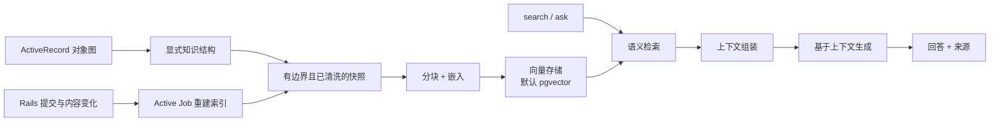

# Maglev

[English](README.md) | [简体中文](README.zh-CN.md)

[](https://github.com/maglev-rb/maglev/actions/workflows/ci.yml)
[](https://www.ruby-lang.org/)
[](https://rubyonrails.org/)
[](LICENSE.txt)

**无需在 Rails 之外另建一套系统，也能让 Rails 模型拥有语义记忆。**

Maglev 是面向 ActiveRecord 对象图的 Rails 原生语义知识层。你只需声明领域模型中哪些信息适合被理解和检索，Maglev 就会把记录、关联关系、附件和富文本转换为可搜索的知识。它通过 Rails 原有的生命周期机制持续更新这些知识，并以熟悉的模型 API 提供语义搜索和有依据的问答能力。

```ruby
Customer.search("存在未解决支持风险的企业客户")
customer.ask("为什么这位客户可能会流失？", user: current_user)
```

Maglev 专注于检索增强生成（RAG）。ActiveRecord 仍然负责精确筛选、关联查询、报表和聚合；Maglev 则处理用自然语言提出的问题。

## 为什么选择 Maglev？

- **Rails 原生：** 它是一个 gem 和 Railtie，而不是独立服务、Engine 或额外 API。
- **模型驱动：** 在拥有数据的 ActiveRecord 模型旁直接声明知识边界。
- **理解对象图：** 支持直接关联、`has_many :through` 和多态关联，并可显式限制深度与记录数。
- **自动保持新鲜：** 已声明记录、直接关联、附件或 Action Text 内容发生变化后，自动重新索引知识所有者。
- **回答有依据：** 仅根据检索到的上下文生成答案，并返回来源。
- **面向生产环境：** 内置授权接口、内容限制、清洗、重试、可观测性和幂等重建索引。
- **可扩展：** 可使用默认的 PostgreSQL/pgvector，也可实现精简的向量存储协议。

## 快速开始

### 1. 安装前置依赖

Maglev 需要 Ruby 3.2+、Rails 7.1 或 8.0、PostgreSQL，以及
[`pgvector`](https://github.com/pgvector/pgvector) 扩展。

将 Maglev 加入应用：

```ruby
# Gemfile
gem "maglev"
```

```bash
bundle install
bin/rails generate maglev:install
bin/rails db:migrate
```

生成器会创建 `config/initializers/maglev.rb` 和 `maglev_chunks` 表迁移，其中包含基于余弦距离的 HNSW 索引。

### 2. 配置模型提供商

Maglev 的默认嵌入和文本生成适配器基于 [`ruby_llm`](https://github.com/crmne/ruby_llm)。

```ruby
# config/initializers/ruby_llm.rb
RubyLLM.configure do |config|
  config.openai_api_key = ENV.fetch("OPENAI_API_KEY")
end

# config/initializers/maglev.rb
Maglev.configure do |config|
  config.embedding_model = "text-embedding-3-small"
  config.embedding_dimensions = 1536
  config.generation_model = "gpt-4.1-mini"
  config.chunk_size = 1000
end
```

如果修改嵌入维度，请在执行迁移前同步修改生成迁移中的向量维度限制。

### 3. 声明模型知识

```ruby
class Customer < ApplicationRecord
  has_many :tickets, inverse_of: :customer
  has_many_attached :contracts
  has_rich_text :notes

  has_knowledge do
    expose :name, :industry, :description, :renewal_at
    hide :internal_risk_score
    tags :customer, :commercial

    include_related :tickets, depth: 1, limit: 20

    expose_attached :contracts
    expose_rich_text :notes
  end
end

class Ticket < ApplicationRecord
  belongs_to :customer, inverse_of: :tickets

  has_knowledge do
    expose :subject, :status, :priority
  end
end
```

只有显式公开的字段和内容源才会进入 Maglev 的知识快照。关联深度和数量限制保证对象图遍历有明确边界。每个关联模型独立声明自己的公开知识，因此连接模型中的敏感字段不会被意外展开。

### 4. 为已有记录建立索引

新建和更新记录时会自动将 `Maglev::ReindexJob` 加入队列。安装后可执行一次已有数据回填：

```bash
bin/rails maglev:reindex[Customer]
# 或重建所有声明了 has_knowledge 的模型
bin/rails maglev:reindex_all
```

请确保生产环境中的 Active Job 后端正在运行。

### 5. 搜索与提问

```ruby
results = Customer.search(
  "存在未解决支持问题的企业客户",
  limit: 10,
  user: current_user
)

results.each do |result|
  result.owner       # => Customer
  result.content     # 检索到的快照分块
  result.source      # => "snapshot"
  result.distance    # 余弦距离，越小越接近
  result.similarity  # 归一化后的便捷相似度分数
end
```

根据检索到的记录生成有依据的回答：

```ruby
response = Customer.ask(
  "哪些客户存在风险？原因是什么？",
  limit: 10,
  user: current_user
)

response.text
response.sources
response.metadata

customer.ask("为什么这位客户可能不满意？", user: current_user)
```

如果没有检索到可用上下文，Maglev 会返回确定性的“上下文不足”响应，而不会让模型自行猜测。

## 工作原理



1. `has_knowledge` 为模型及其声明的关联编译一份显式知识结构。
2. Maglev 根据允许的属性、关联记录、附件、富文本和标签生成确定性的文本快照。
3. 快照被拆成大小受限的分块，并通过配置的适配器生成嵌入向量。
4. 分块被写入向量存储；默认存储使用 PostgreSQL 和 pgvector。
5. `search` 为查询生成嵌入，并执行基于余弦距离的近邻检索。
6. `ask` 在上下文预算内组装分块，构建有依据的提示词，并返回包含来源元数据的答案。
7. Rails 回调会沿对象图传播已声明记录的变化，并为受影响的所有者安排重新索引。

Maglev 不会复制你的关系数据模型。向量文档会指回对应的 ActiveRecord 所有者；事务、业务规则和结构化查询仍由应用负责。

## 知识来源

### ActiveRecord 对象图

`include_related` 支持对普通关联、`has_many :through` 和多态关联进行有限遍历。当 Maglev 无法自动推断关联模型的变化应如何找到知识所有者时，可使用 `inverse:` 显式指定反向关联。

```ruby
has_knowledge do
  include_related :tickets, depth: 2, limit: 25
  include_related :events, depth: 1, limit: 20, inverse: :eventable
end
```

当关联记录从一个所有者转移到另一个所有者时，Maglev 会同时重新索引旧所有者和新所有者。

创建、删除或重新分配连接记录会改变 `has_many :through` 关系，但不会改变关联记录本身。此类连接模型变更后，请在应用中显式加入或执行所有者重新索引。

### Active Storage 与 Action Text

```ruby
has_knowledge do
  expose_attached :contracts, :brief
  expose_rich_text :notes
end
```

HTML 和 Action Text 内容会在索引前进行清洗。附件会受到内容类型、字节大小和提取字符数限制。已声明附件和富文本的变化会触发所有者重新索引。

### 在索引前检查内容

以下开发者 API 可用于确认模型实际公开的内容，且不会调用嵌入或生成服务：

```ruby
Customer.maglev_schema
customer.maglev_snapshot

preview = customer.maglev_context_preview(
  question: "为什么这位客户存在风险？"
)
preview.text
preview.metadata # 包含 provider_calls: 0
```

## 授权

Maglev 不绑定特定的策略库。你可以配置一个简单适配器，在检索和回答时应用应用自身的授权规则：

```ruby
class MaglevAuthorization
  def scope(model:, user:)
    model.accessible_by(user)
  end

  def authorize(record:, user:)
    record.account_id == user.account_id
  end
end

Maglev.configure do |config|
  config.authorization_adapter = MaglevAuthorization.new
end
```

适配器必须实现：

- `scope(model:, user:)`：返回该用户可见的记录。
- `authorize(record:, user:)`：返回 `false` 时拒绝访问记录。

如果未配置适配器，默认允许访问所有记录。凡是需要限定检索范围的调用，都应一致地传入 `user:`。

`customer.explain` 是面向无需用户级授权场景的便捷 API；需要用户上下文时，请使用 `customer.ask(Maglev.configuration.explain_question, user: current_user)`。授权作用域适用于默认 pgvector 检索路径。将直接 `search` 调用与自定义存储结合前，请阅读[向量存储](#向量存储)。

## 配置

```ruby
Maglev.configure do |config|
  config.embedding_model = "text-embedding-3-small"
  config.embedding_dimensions = 1536
  config.generation_model = "gpt-4.1-mini"
  config.chunk_size = 1000

  config.context_max_characters = 4000
  config.context_per_owner_characters = 1200
  config.max_relation_depth = 3

  config.attachment_allowed_content_types = [
    "text/plain",
    "text/markdown",
    "text/html"
  ]
  config.attachment_max_bytes = 5 * 1024 * 1024
  config.attachment_max_characters = 20_000

  config.provider_max_attempts = 2
  config.provider_timeout = 30
  config.logger = Rails.logger
end
```

当应用需要不同的模型提供商或策略行为时，可注入自定义的 `embedding_adapter`、`generation_adapter`、`attachment_extractor`、`authorization_adapter` 或 `source_redactor`。测试环境可以使用确定性适配器，全程不发起网络请求。

## 向量存储

PostgreSQL 与 pgvector 是默认的生产环境方案。对于需要其他存储后端的应用，Maglev 也提供了精简的协议：

```ruby
class MyVectorStore < Maglev::VectorStores::Base
  def upsert(documents:)
    # 使用 document.id 持久化或替换文档
  end

  def search(vector:, filters:, limit:)
    # 返回最近的 Maglev::VectorStores::Document 对象
  end

  def delete(ids:)
    # 删除具有这些稳定 ID 的文档
  end

  def delete_by_owner(owner_type:, owner_id:)
    # 删除属于该所有者的所有文档
  end

  def healthcheck = :ok
  def capabilities = {metadata_filtering: true}
end

Maglev.configure do |config|
  config.vector_store = MyVectorStore.new
end
```

`Maglev::VectorStores::Memory` 适合测试和本地实验。自定义存储应保留文档元数据筛选能力和稳定的文档标识语义。

自定义向量存储目前会收到模型和所有者元数据筛选条件，但不会收到已配置的授权作用域。`ask` 仍会逐条授权检索到的所有者；使用自定义存储时，不能将直接 `search(..., user:)` 视为已按授权过滤。需要时请在自定义存储内部应用租户或策略筛选；如果搜索必须遵守授权作用域，请使用默认 pgvector 路径。

## 运维与可观测性

```bash
bin/rails maglev:status
bin/rails maglev:reindex[Customer]
bin/rails maglev:reindex_all
```

重建索引可安全重复执行：未变化的分块会被复用，过期分块会被删除。Maglev 会为索引开始/成功/失败、检索、生成和提供商重试发出 ActiveSupport 通知：

```ruby
ActiveSupport::Notifications.subscribe(/\Amaglev\./) do |name, start, finish, id, payload|
  Rails.logger.info(
    event: name,
    duration_ms: ((finish - start) * 1000).round(1),
    **payload
  )
end
```

## 安全与能力边界

- 应将提取内容视为不可信上下文。Maglev 会清洗支持的 HTML 来源，但授权和模型公开范围仍由应用负责。
- 只公开适合发送给所配置模型提供商的字段和内容源。
- 默认附件限制为 5 MiB 和 20,000 个提取字符；默认允许纯文本、Markdown、HTML 和 XHTML。
- v1 生成迁移使用 `bigint` 所有者 ID。使用 UUID 的模型需要自定义迁移。
- Maglev 只负责 RAG。它不会生成 SQL、通过数据库计算回答聚合问题、公开 REST 端点、提供管理界面、运行 Agent 或管理对话记忆。

## 兼容性

CI 测试矩阵如下：

| | 支持版本 |
|---|---|
| Ruby | 3.2、3.3 |
| Rails | 7.1、8.0 |
| 数据库 | PostgreSQL + pgvector |

矩阵之外的版本可能可以运行，但目前不作保证。

## 开发

```bash
bundle install

# PostgreSQL + pgvector 集成测试
MAGLEV_REQUIRE_POSTGRESQL=true MAGLEV_DATABASE=maglev_test bundle exec rspec

bundle exec standardrb
bundle exec rubocop
bundle exec rake build
```

默认测试套件使用确定性的虚拟适配器，不会调用真实的 LLM 或嵌入服务。

## 许可证

Maglev 以 [MIT License](LICENSE.txt) 开源发布。
