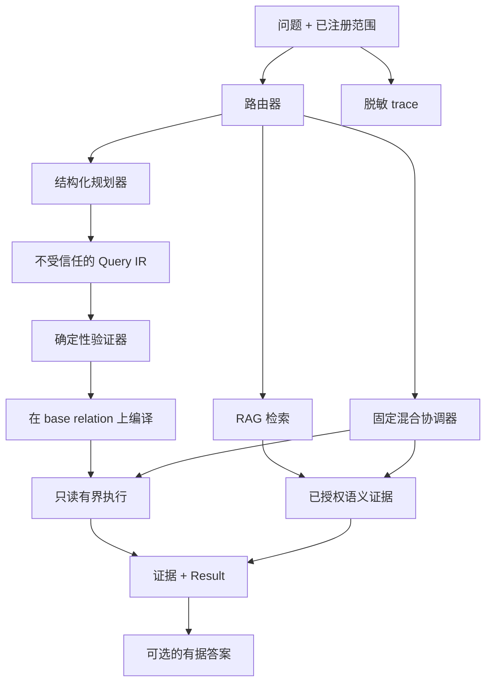

# Maglev

[English](README.md) | [简体中文](README.zh-CN.md) | [日本語](README.ja.md)

[](https://github.com/benjis/maglev/actions/workflows/ci.yml)
[](https://www.ruby-lang.org/)
[](https://rubyonrails.org/)
[](LICENSE.txt)

Maglev 0.2 是面向 ActiveRecord 应用的 Rails 原生只读知识与查询层。应用可以通过三条明确路线回答自然语言问题：

- **结构化查询：** 问题 → 经过验证的 Query IR → 可组合的
  `ActiveRecord::Relation` 或有界聚合值。
- **RAG：** 问题 → 经过授权的语义检索 → 可选的有据回答。
- **混合查询：** 用两种固定流程之一组合结构化筛选与 RAG 证据。

模型只暴露应用显式声明的 allowlist。结构化编译始终从调用方提供的 base relation 开始，并且只能继续收窄。RAG 检索与答案生成彼此独立。

```ruby
resource_authorizer = ->(_entry, user) { user.account_id == current_account.id }
result = current_account.invoices.maglev_request(
  "金额超过 500 美元的未结发票",
  mode: :structured,
  planner_adapter: planner,
  authorizer: resource_authorizer,
  user: current_user
)

retrieval = SupportTicket.retrieve("取消流程中受阻的客户", user: current_user)
answer = SupportTicket.ask("反复出现了哪些取消问题？", user: current_user)
```

## 从这里开始：先选择数据路径

第一次使用 Maglev 时，不需要先理解完整架构。先判断问题需要哪种数据：

| 用户问题 | 所需数据 | 声明 | 调用方式 |
| --- | --- | --- | --- |
| “有多少发票已经逾期？” | 精确字段、筛选、计数 | `queryable` | `maglev_request(..., mode: :structured)` |
| “客户取消服务时主要抱怨什么？” | 正文、评论、附件等自由文本 | `knowledge` | `retrieve` 或 `ask` |
| “哪些未关闭工单提到了重复扣款？” | 精确状态 + 语义文本 | 两者都声明 | `maglev_request(..., mode: :hybrid)` |

只需要记住四件事：

1. `maglev_resource :support_tickets` 给模型一个稳定的 Maglev 资源名。
2. `queryable` 是结构化查询 allowlist：规划器只能筛选、排序、关联或聚合这里声明的内容。
3. `knowledge` 选择哪些内容会变成可语义检索的证据。
4. 授权仍由应用提供；结构化查询还必须从调用方的
   `ActiveRecord::Relation` 开始。Maglev 不会自行扩大权限。

## 为什么选择 Maglev？

- 普通 Ruby gem + `Maglev::Railtie`，不是 Rails Engine 或独立 API 服务。
- ActiveRecord-first 结构化查询；不生成或执行不受限 SQL/Ruby。
- 显式注册可查询字段、关联、scope、聚合和知识来源。
- 由应用拥有的 relation 携带租户和授权约束。
- 基于 pgvector 的来源感知 RAG，具有归一化相似度、确定性预算和可检查证据。
- 不可变计划/结果和默认脱敏 trace。
- 默认测试使用确定性 fake adapter，不调用线上模型服务。

## 架构



Registry 是权限边界。一次请求的 schema snapshot 只包含已注册且已授权的资源，绝不包含记录值。Provider 输出在通过确定性验证前一律不受信任。

## 安装

Maglev 需要 Ruby 3.3+、Rails 7.1 或 8.0、PostgreSQL 和 pgvector。

```ruby
# Gemfile
gem "maglev-rb", "~> 0.2.0"
```

```bash
bundle install
bin/rails generate maglev:install --embedding-dimensions=1536
bin/rails db:migrate
```

Generator 会创建 initializer、`maglev_chunks`、来源/租户元数据、HNSW 余弦索引和 `maglev_index_states` 诊断表。Owner 使用 UUID 主键时请检查并调整生成的迁移。

## 配置

内置 embedding 和 generation 客户端使用 OpenAI-compatible HTTP 协议。Planner 默认使用 OpenAI 的 `json_schema` response format；不支持该能力的服务商可以改用约束较弱的 `json_object` format。Embedding 与 generation 可以使用不同服务商。

```ruby
Maglev.configure do |config|
  config.embedding_provider do |provider|
    provider.url = ENV.fetch("MAGLEV_EMBEDDING_URL", "https://api.openai.com/v1")
    provider.api_key = ENV["MAGLEV_EMBEDDING_API_KEY"]
    provider.model = "text-embedding-3-small"
    provider.dimensions = 1536
  end

  config.generation_provider do |provider|
    provider.url = ENV.fetch("MAGLEV_GENERATION_URL", "https://api.openai.com/v1")
    provider.api_key = ENV["MAGLEV_GENERATION_API_KEY"]
    provider.model = "gpt-4.1-mini"
  end

  config.planner_adapter = Maglev::Adapters::FaradayPlanner.new
  # 用于不支持 json_schema 的服务商：
  # config.planner_adapter = Maglev::Adapters::FaradayPlanner.new(response_format: :json_object)
  config.routing_adapter = MyRoutingAdapter.new # 仅 mode: :auto 需要

  config.chunk_size = 1000
  config.minimum_similarity = nil
  config.retrieval_max_candidates = 1000
  config.context_max_characters = 4000
  config.context_per_owner_characters = 1200

  config.snapshot_attribute_max_characters = 20_000
  config.snapshot_related_record_max_characters = 50_000
  config.snapshot_max_characters = 100_000
  config.snapshot_max_chunks = 100

  config.structured_query_timeout = 5
  config.structured_evidence_max_rows = 100
  config.structured_evidence_max_bytes = 32_768
end
```

若内置协议不适用，可以注入自定义 `embedding_adapter`、`generation_adapter`、`planner_adapter`、`routing_adapter`、`attachment_extractor` 或 `authorization_adapter`。

## 注册资源

`maglev_resource` 是 v0.2 的主要 DSL。结构化查询能力与知识能力彼此独立，可以同时声明，也可以只声明一种。

### 一个带完整注释的结构化资源

```ruby
class Invoice < ApplicationRecord
  # Rails 关联和 scope 仍然是业务逻辑的事实来源。
  belongs_to :account
  scope :due_before, ->(date) { where(due_on: ..date) }

  # :invoices 是 Maglev plan/request 使用的稳定资源标识符。
  maglev_resource :invoices do
    # 帮助 planner 理解这个资源代表什么。
    description "属于已授权账户的发票"
    synonyms "bills"

    # 这个 block 只控制结构化 ActiveRecord 查询。
    queryable do
      # 允许对这些真实数据库字段执行精确筛选和排序。
      # enum 同时限定 planner 可以使用的状态值。
      field :status, enum: %w[draft open paid void]
      field :amount, description: "以账户币种表示的发票总额"
      field :due_on, synonyms: ["deadline", "截止日期"]
      field :paid_at

      # 即使 planner 请求，也明确禁止这些敏感字段。
      prohibit :number, :internal_note

      # 允许通过已注册关联连接到另一个 :accounts 资源。
      association :account, resource: :accounts

      # 允许调用这个已有 Rails scope，并定义其参数类型。
      scope :due_before,
        parameters: {date: {type: :date, required: true}}

      # 只开放这些聚合函数和字段。
      aggregates count: true, sum: [:amount], average: [:amount]

      # 资源级上限，会与全局/请求级限制取最严格值。
      limits rows: 50, operations: 8, joins: 1

      # 每次结构化规划都必须由调用方授权该资源。
      authorization :required
    end

    # 这个独立 block 控制语义索引和 RAG。
    # 字段在这里重复出现，不会扩大结构化查询权限。
    knowledge do
      expose :status, :amount, :due_on, :paid_at
    end
  end
end
```

Maglev 不会隐式暴露任何内容。`authorization :required` 表示：除非调用方明确授权，否则该资源不会进入请求的 schema snapshot。`allow_unscoped_model_queries` 必须显式启用，且只应供真正公开的数据使用。

`queryable` 只定义受约束的 ActiveRecord 查询契约；`knowledge` 只定义 RAG
索引和检索来源；`maglev_resource` 是统一资源声明，可以只包含其中一个 block，
也可以同时包含两者。未声明 `knowledge` 的模型不能使用 `search`、`retrieve`、
`ask`、snapshot 或索引 callback。

请把声明理解为 allowlist，而不是数据库 schema 的复制。未出现在 `field` 中的列
不能进入 Query IR；未出现在 `expose` 或其他 knowledge source 中的值不会进入语义
snapshot。

### 为什么一个字段可以同时出现在两个 block 中

同一字段可以承担两种不同职责：

- `field :status` 允许结构化查询生成 `status = "open"` 这样的精确条件。
- `expose :status` 会把 `status: open` 写入索引 snapshot，让检索证据保留上下文。

声明一边不会自动声明另一边。标识符、日期、枚举和金额适合放入 `queryable`；
描述、正文、评论、解决记录和附件文本适合放入 `knowledge`；状态、优先级、产品区域
这类上下文字段则经常需要同时声明。

### 一个真正体现 RAG 价值的资源

当答案存在于人写的语言中，而不是某个精确列里时，RAG 才真正有价值。下面的结构化
查询可以找出 open/high-priority 工单，而 RAG 可以从工单正文、评论、解决记录和日志
附件中理解“重复扣款”这类不同措辞。

```ruby
class SupportTicket < ApplicationRecord
  belongs_to :account
  has_many :comments
  has_many_attached :files
  has_rich_text :resolution

  maglev_resource :support_tickets do
    description "客户支持请求及其调查证据"

    queryable do
      # 适合结构化查询：精确、有类型、便于筛选。
      field :status, enum: %w[open pending resolved closed]
      field :priority, enum: %w[low normal high urgent]
      field :product_area
      field :created_at
      prohibit :requester_email, :internal_notes
      limits rows: 100, operations: 8, joins: 1
      authorization :required
    end

    knowledge do
      # 正文包含精确筛选无法表达的语义。
      expose :subject, :body

      # 与 queryable 重叠，使证据保留业务上下文。
      expose :status, :priority, :product_area

      # 只纳入数量和顺序都确定的关联对话。
      include_related :comments, depth: 1, limit: 20,
        order: {created_at: :desc}

      # 纳入受支持的附件文本和 Action Text 内容。
      expose_attached :files
      expose_rich_text :resolution
    end
  end
end
```

被 `include_related` 使用的关联模型也必须声明自己的
`maglev_resource ... knowledge`。只需要 RAG 时省略 `queryable`；只需要结构化查询时
省略 `knowledge`。

记录完成索引后，下面三个调用解决不同问题：

```ruby
# 只返回语义证据，不调用 generation provider。
evidence = SupportTicket.retrieve(
  "客户说取消服务后仍被重复扣款",
  limit: 10,
  user: current_user
)

# 根据选中的工单证据生成有据可查的自然语言回答。
answer = SupportTicket.ask(
  "取消服务后反复出现了哪些重复扣款模式？",
  limit: 5,
  user: current_user
)

# 先按数据库字段精确筛选，再只在结果集合中做语义检索。
result = current_account.support_tickets.maglev_request(
  "客户描述被重复扣款的未关闭紧急工单",
  mode: :hybrid,
  hybrid_plan: :structured_first,
  planner_adapter: planner,
  authorizer: resource_authorizer,
  user: current_user
)
```

默认附件提取器支持纯文本、Markdown、HTML 和 XHTML。PDF、Office、OCR、图片、音视频解析需要应用自定义 extractor。Snapshot、relation、附件和 chunk 都有硬预算。

无需调用 provider 即可检查暴露内容：

```ruby
SupportTicket.maglev_schema
ticket.maglev_snapshot
ticket.maglev_context_preview(question: "为什么还未解决？")
ticket.maglev_index_status
```

### DSL API 参考

资源级 DSL：

| DSL | 用途 |
| --- | --- |
| `maglev_resource :identifier` | 为模型注册一个稳定的资源标识符。 |
| `description "..."` | 提供给 planner 的资源说明；不会包含记录值。 |
| `synonyms "...", "..."` | 资源可能使用的其他名称。 |
| `queryable { ... }` | 声明结构化 ActiveRecord 能力；只能出现一次。 |
| `knowledge { ... }` | 声明 RAG/索引能力；只能出现一次。 |

`queryable` DSL：

| DSL | 用途与选项 |
| --- | --- |
| `field :name` | 允许一个真实字段。选项：`description:`、`synonyms:`、`enum:`、`sensitive:`。敏感字段不会进入 planner schema。 |
| `prohibit :a, :b` | 明确禁止真实字段；同一字段不能既允许又禁止。 |
| `association :account, resource: :accounts` | 允许一个已注册 ActiveRecord 关联路径。支持 `description:`、`synonyms:`；目标资源也必须注册。 |
| `scope :due_before, parameters: {...}` | 允许一个已有 model scope。参数 metadata 支持 `type`、`required`、`nullable`、`enum_values`、`minimum`、`maximum`。其他 scope 不能调用。 |
| `aggregates count: true, sum: [:amount]` | 允许 `count`、`sum`、`average`、`minimum`、`maximum`；字段列表进一步限制聚合目标。 |
| `limits rows:, operations:, joins:` | 设置正整数资源上限；最终使用所有配置中最严格的限制。 |
| `authorization :required` | 默认值。只有 `authorizer` 批准后，资源才进入 schema snapshot。 |
| `authorization :public` | 资源 schema 公开；记录访问仍受传入 relation 约束。 |
| `allow_unscoped_model_queries true` | 允许没有 base relation 的结构化请求。默认关闭，只应用于真正公开的数据。 |

Scope 参数 `type` 支持 `:string`、`:integer`、`:float`、`:decimal`、
`:boolean`、`:date`、`:datetime`、`:timestamp` 和 `:time`。注册资源时会拒绝不支持的类型。

`knowledge` DSL：

| DSL | 用途与选项 |
| --- | --- |
| `expose :subject, :body` | 把指定的非 nil 模型字段加入可搜索 snapshot。 |
| `hide :internal_notes` | 明确记录不得暴露的字段；同一字段不能同时 expose 和 hide。 |
| `tags :support, :customer` | 给该模型的每个 snapshot 添加固定分类标签。 |
| `include_related :comments, depth:, limit:` | 加入有界关联记录 snapshot。`inverse:` 可指定不明显的反向关联；`order:` 接受字段或 `{field: :asc/:desc}`。 |
| `expose_attached :files` | 加入指定 Active Storage 附件中提取出的文本。 |
| `expose_rich_text :resolution` | 加入指定 Action Text 字段的纯文本。 |

Maglev 不会根据数据库可见性自动推断权限。DSL 会在注册时验证；未知字段、关联、
scope 或附件会立即抛出 `Maglev::ConfigurationError`。

## 结构化查询

规划与执行刻意分离。

```ruby
base = current_account.invoices.where(archived: false)

plan = Maglev.plan(
  "本月到期、金额超过 500 美元的未结发票",
  resource: :invoices,
  base_relation: base,
  authorizer: ->(entry, user) { user.account_id == current_account.id },
  user: current_user,
  constraints: {rows: 25, operations: 8, joins: 1},
  adapter: planner
)

plan.status                # :ready / :clarification_required / :unsupported / :invalid
plan.ir                    # ready 时为不可变 Maglev::QueryIR::Query
plan.explanation
plan.policy_limits         # 实际生效的 rows/operations/joins/complexity
plan.evidence_requirements
plan.trace_id

result = Maglev.execute(plan)
result.status              # :succeeded
result.kind                # :relation 或 :aggregate
result.value               # 受保护的 relation 或有界 scalar
result.evidence
result.render
```

记录 relation 在读取前保持 lazy 和可组合。读取发生在带 `statement_timeout` 的 PostgreSQL 只读事务中；返回记录只读，批量写操作会被拒绝。

Query IR v1 支持已注册 scope；`eq`、`not_eq`、`gt`、`gte`、`lt`、`lte`、`in`、`not_in`、`is_null`、`is_not_null`、`between`；最多两层 join；sort、distinct、limit；以及 count、sum、average、minimum、maximum。它不能包含 SQL、Arel、Ruby、任意方法、写操作、锁、嵌套布尔组、窗口函数、子查询、`HAVING` 或规划器自定义工具。

## RAG：search、retrieve 与 ask

知识资源仍然可以直接使用模型 API。

```ruby
matches = SupportTicket.search(
  "取消流程故障",
  limit: 10,
  minimum_similarity: 0.65,
  user: current_user
)

matches.first.owner
matches.first.source_identity
matches.first.source_type
matches.first.similarity
```

`search` 每个 owner 最多返回一个 `SearchResult`。需要完整、无生成的检索诊断时使用 `retrieve`：

```ruby
retrieval = SupportTicket.retrieve(
  "取消流程故障",
  limit: 10,
  chunks_per_owner: 2,
  user: current_user
)

retrieval.considered
retrieval.selected
retrieval.rejected
retrieval.context
retrieval.budgets
retrieval.reasons
retrieval.timings
retrieval.trace_id
```

只有需要自然语言答案时才调用生成：

```ruby
answer = SupportTicket.ask(
  "哪些取消故障反复出现？",
  limit: 5,
  chunks_per_owner: 2,
  minimum_similarity: 0.65,
  user: current_user
)

answer.text
answer.sources
answer.metadata
```

若授权、相似度或上下文预算过滤掉全部证据，`ask` 会返回确定性的 insufficient context，且不调用 generation provider。

## 统一请求与路由

需要统一 Result envelope 或路线选择时，使用 `Maglev.request`、`Model.maglev_request` 或 `relation.maglev_request`。

```ruby
result = current_account.invoices.maglev_request(
  "有多少未结发票已经逾期？",
  mode: :structured,
  planner_adapter: planner,
  authorizer: resource_authorizer,
  user: current_user
)

result.status
result.route
result.kind
result.value
result.evidence
result.warnings
result.trace_id
result.confidence
result.reasons
result.metadata
```

Mode 包括 `:structured`、`:rag`、`:hybrid`、`:auto`。显式 mode 永不调用路由 classifier。自动路由需要 `routing_adapter`，并且只会收到有界 capability summary，不会收到记录值或来源正文。应用级请求必须提供 resources/models 或 base relation；Maglev 永远不会扫描所有应用模型。

Routing adapter 实现 `classify(question:, capabilities:)`，并返回例如
`{"route" => "structured", "confidence" => 0.9, "reasons" => ["exact fields"]}`
的结果。Confidence 仅供参考，绝不授予权限。

通过统一 API 获得生成式 RAG 答案时传入 `answer: true`；否则 RAG 路线返回 `kind: :semantic_matches`。

## 混合流程

Hybrid 只支持两种固定 shape，并要求一个同时声明 queryable 与 knowledge 的资源。

```ruby
result = current_account.support_tickets.maglev_request(
  "提到取消问题的未结工单",
  mode: :hybrid,
  hybrid_plan: :structured_first, # 或 :rag_first
  planner_adapter: planner,
  authorizer: resource_authorizer,
  candidate_limit: 100,
  user: current_user
)

result.kind                      # :hybrid_answer
result.value.records
result.evidence                  # 带 structured/RAG provenance
result.metadata[:plan_shape]
result.metadata[:operations]
```

Structured-first 先筛选记录，再在候选中检索；RAG-first 先检索 owner，再通过授权 relation 验证。候选项只传递有界且经过类型转换的主键；每个阶段都会重新应用注册、租户、base relation 和授权约束。系统不会循环或自主调用工具。

## 授权与租户

Base relation 是 structured 和 hybrid 的权限边界：

```ruby
current_account.invoices.maglev_request(
  question, mode: :structured, authorizer: resource_authorizer, user: current_user
)
policy_scope(Invoice).maglev_request(
  question, mode: :structured, authorizer: resource_authorizer, user: current_user
) # Pundit
Invoice.accessible_by(current_ability).maglev_request(
  question, mode: :structured, authorizer: resource_authorizer, user: current_user
) # CanCanCan
```

RAG 授权使用可选 adapter：

```ruby
class MaglevAuthorization
  def scope(model:, user:) = model.where(account_id: user.account_id)
  def authorize(record:, user:) = record.account_id == user.account_id
end

Maglev.configure do |config|
  config.authorization_adapter = MaglevAuthorization.new
  config.tenant_id_resolver = lambda do |record: nil, user: nil|
    (record || user)&.account_id&.to_s
  end
end
```

没有 RAG authorization adapter 时，默认允许所有记录。所有用户范围内的检索都应配置 adapter 并传入 `user:`。

存储支持时会下推授权过滤；hydrate 后仍会重新检查每条记录。授权 scope 超过 1,000 个 owner ID 时会 fail closed。

## 索引、升级与运维

```bash
bin/rails maglev:status
bin/rails maglev:reindex[SupportTicket]
bin/rails maglev:reindex_all
bin/rails maglev:evaluate_planner
```

相关事务提交后 callback 会入队 `Maglev::ReindexJob`。索引操作幂等、复用未变化 chunk、原子替换单个 owner 的完整可搜索代际，并记录安全的状态和失败诊断。

从 0.1.x 升级请遵循 [CHANGELOG.md](CHANGELOG.md)：

```bash
bin/rails generate maglev:upgrade_index_version
bin/rails generate maglev:upgrade_source_identity
bin/rails db:migrate
bin/rails maglev:reindex_all
```

请检查生成的迁移。Embedding 维度变化时需要单独修改 vector 列、重建 HNSW 索引，再完成全量 reindex。旧记录在具有当前 index identity 前不会参与检索。

### Index identity 与安全替换

每个 chunk 都保存 `index_version`。Fingerprint 格式版本 1 使用
`maglev-index` namespace，并覆盖 embedding 模型/维度、adapter ID/版本、
chunking 算法/大小和 `application_index_version`。自定义 embedding adapter
应实现 `maglev_adapter_id` 与 `maglev_adapter_version`，或配置
`embedding_adapter_id` 与 `embedding_adapter_version`。

`upgrade_index_version` 迁移会有意添加可空的 `index_version`。Legacy row
在全量 reindex 获得当前 identity 前不可检索。维度变化时必须先迁移 vector
列，再执行 reindex。Owner 替换失败时必须保留上一代完整内容。

## Vector store 契约

PostgreSQL/pgvector 是生产默认方案；`Maglev::VectorStores::Memory` 适合测试和本地实验。自定义 store 实现 `fetch(ids:)`、`upsert(documents:)`、`search(vector:, filters:, limit:)`、`delete(ids:)`、`delete_by_owner(owner_type:, owner_id:)`、原子的 `replace_owner(owner_type:, owner_id:, documents:)`、`healthcheck` 和 `capabilities`。

`delete_by_owner` 后接 `upsert` 不是原子替换。同一 owner 的并发替换/删除必须线性化；替换失败必须保留上一代完整内容。

## Trace、证据与安全边界

Maglev Result 包含有界证据和 trace ID。Trace 记录标识符、决策、操作名、限制、安全计时、警告和错误类；默认排除记录值、来源正文、prompt、密钥和原始 provider payload。持久化和保留策略由宿主应用负责。

Maglev 0.2 **不提供**：

- 自然语言写操作或 mutation；
- 不受限 SQL、Ruby、Arel、scope 或代码执行；
- 自主/迭代 Agent；
- Rails Engine、REST API、管理 UI 或强制前端；
- 内置 PDF/Office/OCR/音频解析；
- streaming 或对话记忆；
- Qdrant 或其他强制外部向量服务。

检索文档只是证据，绝不是能够改变路线、权限、Query IR 或执行策略的指令。

## 运行环境支持与开发

| 组件 | 支持版本 |
| --- | --- |
| Ruby | 3.3、4.0 |
| Rails | 7.1、8.0 |
| 数据库 | PostgreSQL + pgvector |

```bash
bundle exec rspec
bundle exec standardrb
bundle exec rubocop
bundle exec rake build
bundle exec rake maglev:release_audit
```

默认测试使用确定性 fake，不调用线上 LLM 或 embedding provider。

## 许可证

Maglev 使用 [MIT License](LICENSE.txt)。
